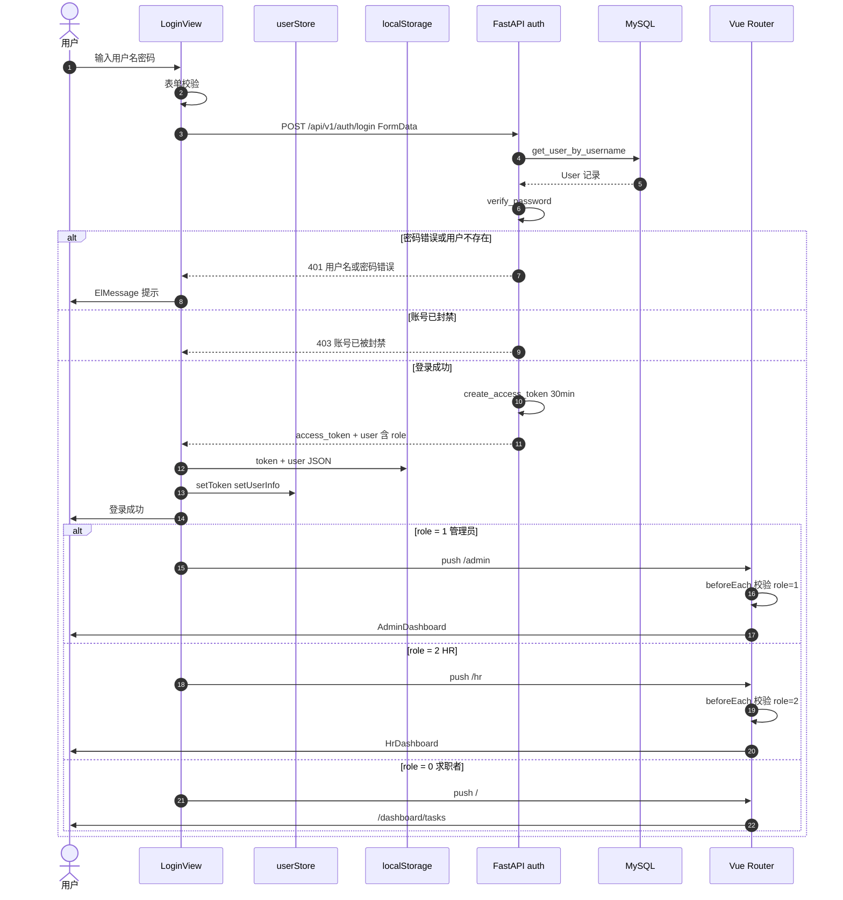
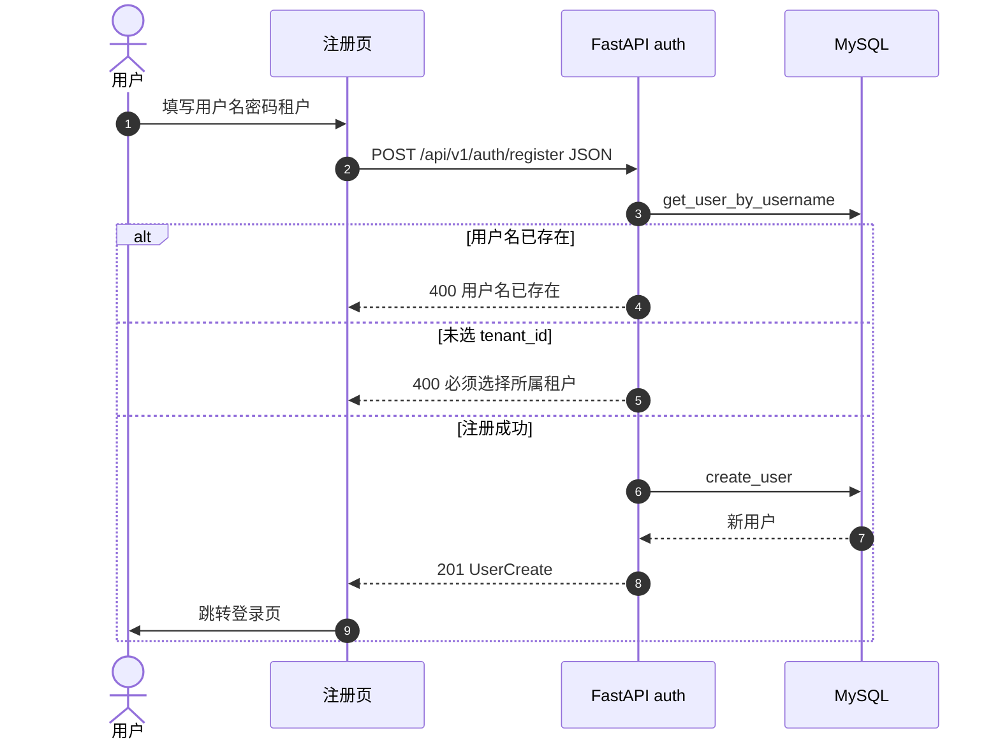
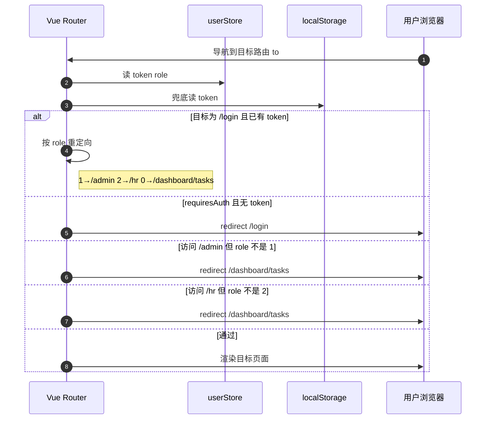

# 认证与角色分流序列图

> 预览：安装 **Markdown Preview Mermaid Support**，打开本文件 `Ctrl+Shift+V`；或复制 `mermaid` 到 [Mermaid Live Editor](https://mermaid.live)。

---

## 30 秒读懂

**登录**：前端 FormData → `POST /auth/login` → 校验密码 → 签发 JWT → 存 `localStorage` + Pinia → 按 `role` 跳转。  
**注册**：`POST /auth/register` → 校验用户名与租户 → 写库。  
**路由守卫**：后续访问受保护路由时，守卫读 token 与 role，拦截越权访问。

角色约定：`0` 求职者 · `1` 平台管理员 · `2` HR/导师。

---

## 登录与角色分流序列图

---

## 注册序列图

---

## 路由守卫序列图（已登录用户访问受保护页）

---

## 后续请求的 JWT 校验

受保护 API 通过 `Depends(get_current_user)` 解析 `Authorization: Bearer {token}`，与登录序列独立；失败返回 `401`。

| 角色 | 典型 API 前缀 |
|------|---------------|
| 求职者 | `/api/v1/user/*`、`/api/v1/resume/*` |
| 管理员 | `/api/v1/admin/*` |
| HR/导师 | `/api/v1/mentor/*`、`/api/v1/hr/*` |

---

## 与其它文档

| 文档 | 内容 |
|------|------|
| [use-case.md](./use-case.md) | 登录/注册用例 |
| [function-structure.md](./function-structure.md) | 公共认证模块 |
| **本文件** | 登录注册与前端分流的时序 |

---

## 文档命名约定

- 文件名：`docs/auth-sequence.md`
- 一级标题：`# 认证与角色分流序列图`
