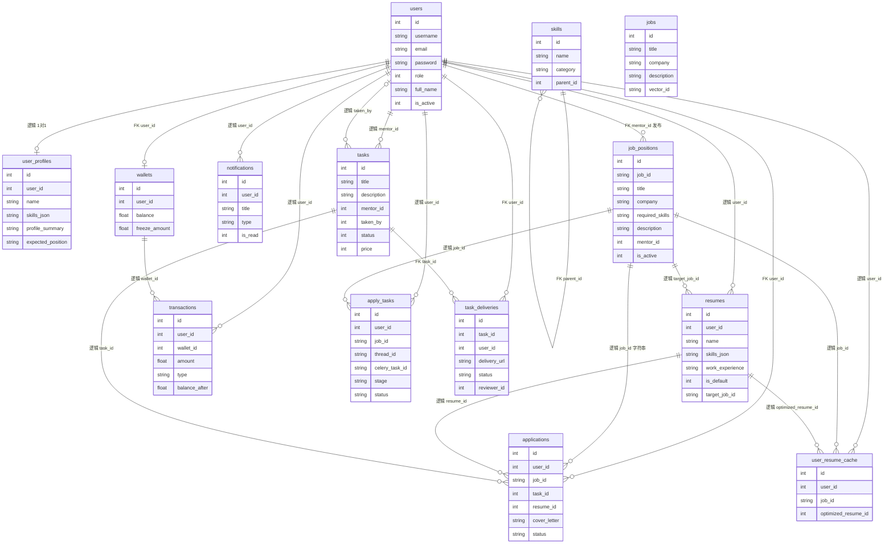
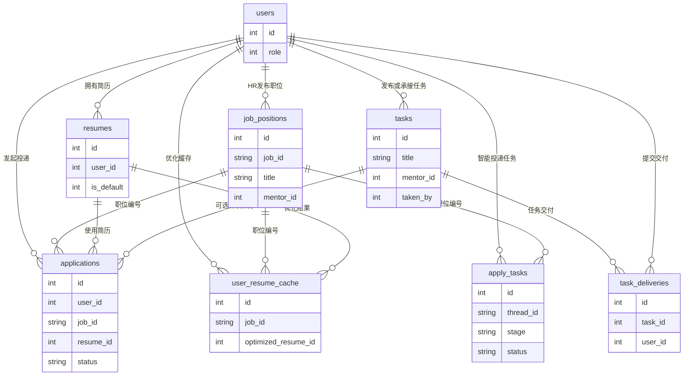

# 数据库 ER 图

> 依据 MySQL 结构导出 `dandelion_tribe_schema.sql`（库名 `dandelion_tribe`）绘制。  
> 预览：安装 **Markdown Preview Mermaid Support**，`Ctrl+Shift+V`；或复制 `erDiagram` 到 [Mermaid Live Editor](https://mermaid.live)。

**图例：** 实线关系 = SQL 中有 `FOREIGN KEY`；文档表格中标注「逻辑」= 仅有索引或业务关联、无物理外键。

**Mermaid 注意：** `erDiagram` 属性行只能是 `类型 字段名` 两个词，不要写 `PK` / `UK` / `FK`（会触发 Parse error）。主键与外键见下方表格。

---

## 30 秒读懂

- **用户 `users`** 是中心：简历、投递、任务、钱包、通知都围绕用户展开。
- **职位以 `job_positions` 为准**；`jobs` 为历史表，当前推荐/投递代码主要用 `job_positions`。
- **智能投递** 额外用 `apply_tasks`、`user_resume_cache`；`job_id` 多为 **字符串业务编号**，连 `job_positions.job_id` 而非主键 `id`。
- **成长任务** 用 `tasks`（管理端 API 路径叫 projects）+ `task_deliveries`。

---

## 全库 ER 图（14 张表）



---

## 核心业务 ER 图（TalentFlow 主路径）

> 论文/答辩若嫌全库太杂，可只放本图：招聘 + 简历 + 智能投递 + 成长任务。



---

## 关系说明表

### 物理外键（SQL 中已声明）

| 子表 | 字段 | 父表 | 约束名 |
|------|------|------|--------|
| applications | user_id | users.id | fk_app_user |
| job_positions | mentor_id | users.id | fk_job_position_mentor |
| task_deliveries | task_id | tasks.id | fk_td_task |
| task_deliveries | user_id | users.id | fk_td_user |
| wallets | user_id | users.id | fk_wallet_user |
| skills | parent_id | skills.id | fk_skill_parent |

### 逻辑关联（无物理 FK，ER 图仍保留）

| 子表 | 字段 | 关联方式 |
|------|------|----------|
| resumes | user_id | → users.id |
| applications | job_id (varchar) | → job_positions.**job_id**（业务编号，非 id） |
| applications | resume_id | → resumes.id |
| applications | task_id | → tasks.id |
| apply_tasks | user_id, job_id | → users.id；job_positions.job_id |
| user_resume_cache | user_id, job_id, optimized_resume_id | users；job_positions.job_id；resumes.id |
| resumes | target_job_id | → job_positions.job_id（可选） |
| notifications | user_id | → users.id |
| user_profiles | user_id (UNIQUE) | → users.id，一对一 |
| transactions | user_id, wallet_id | → users.id；wallets.id |
| tasks | mentor_id, taken_by | → users.id |

### 特殊说明

| 表 | 说明 |
|----|------|
| `jobs` | 旧职位表，有全文索引；当前后端以 `job_positions` 为主，推荐向量也基于后者 |
| `apply_tasks` | 引擎 MyISAM，**无 FK**；智能投递 LangGraph thread 追踪 |
| `applications.status` | pending / viewed / interviewed / rejected / accepted |
| `users.role` | 0 求职者，1 管理员，2 HR（与前端路由一致） |

---

## 与后端 SQLModel 的差异（画图以本 SQL 为准）

| 项 | 数据库（本导出） | 代码模型 |
|----|------------------|----------|
| applications.job_id | varchar，逻辑连 job_positions.job_id | 模型写 FK 到 job_positions.**id** |
| jobs 表 | 存在 | app/models/job.py 为空 |
| notifications / user_profiles / skills | 有表 | 模型文件多为空 |
| wallets / transactions | 有表 | 财务相关 API 可能未全接 |
| tenant_id | 无 | crud.create_user 仍传 tenant_id（遗留） |

---

## 域划分（可选子图说明）

```text
┌──────────── 用户域 ────────────┐
│ users ─ user_profiles          │
│   ├─ resumes                   │
│   ├─ wallets ─ transactions    │
│   └─ notifications             │
└────────────────────────────────┘

┌──────────── 招聘域 ────────────┐
│ job_positions (主)             │
│   ├─ applications              │
│   ├─ apply_tasks               │
│   └─ user_resume_cache         │
│ jobs (历史，可标灰)            │
└────────────────────────────────┘

┌──────────── 任务域 ────────────┐
│ tasks ─ task_deliveries        │
│ applications.task_id 可指向任务 │
└────────────────────────────────┘

┌──────────── 字典 ──────────────┐
│ skills (自关联树)              │
└────────────────────────────────┘
```

---

## 与其它文档

| 文档 | 内容 |
|------|------|
| [function-structure.md](./function-structure.md) | 功能模块分层 |
| [smart-apply-flow.md](./smart-apply-flow.md) | 智能投递流程 |
| **本文件** | MySQL 表结构与实体关系 |

**结构来源：** `dandelion_tribe_schema.sql`（建议放在项目 `docs/` 或 `scripts/` 备查，与线上一致时重新导出更新本图）。

---

## 文档命名约定

- 文件名：`docs/database-er.md`
- 一级标题：`# 数据库 ER 图`
