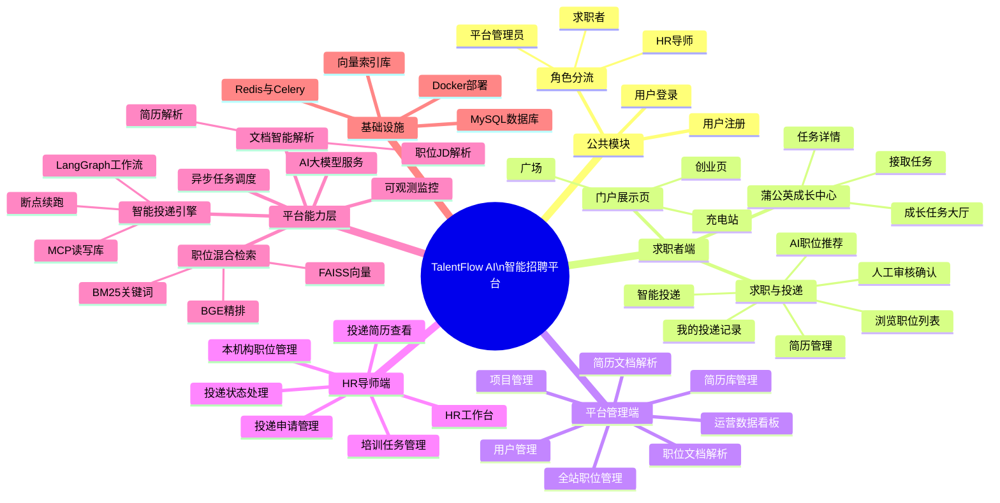
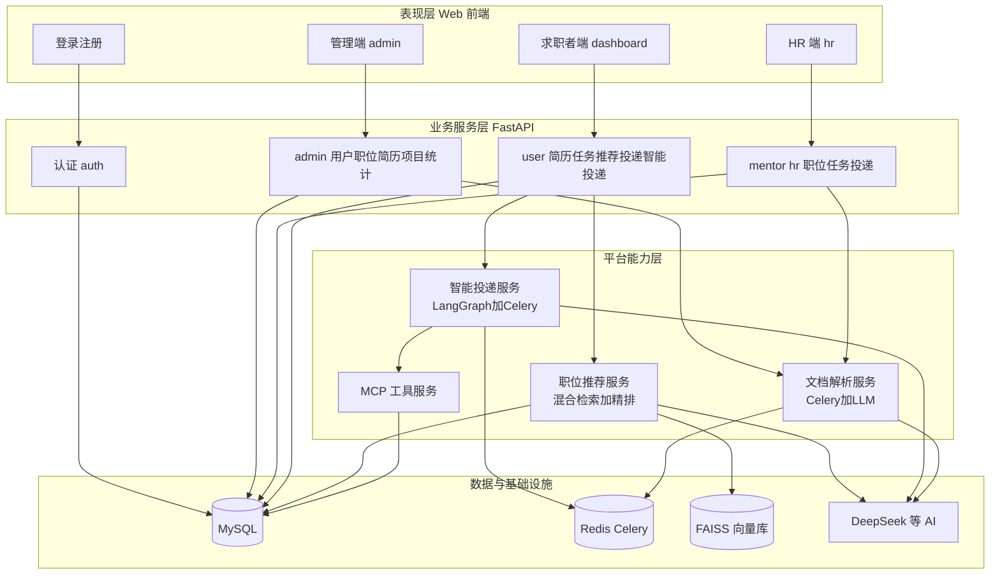

# 功能结构图

> 预览：安装 **Markdown Preview Mermaid Support**，打开本文件 `Ctrl+Shift+V`；或复制 `mermaid` 到 [Mermaid Live Editor](https://mermaid.live)。

---

## 系统功能结构图

> **说明：** 按 **业务子系统 → 功能模块 → 具体功能** 三级展开；最下方 **平台能力层** 为各业务共用的 AI / 任务 / 数据能力（不是单独菜单，但在结构中单独列出便于理解）。

---

## 分层功能结构图

> 从 **用户看到的** 到 **底层支撑的** 四层关系（与上一张 mindmap 互补）。

---

## 三级功能分解表

### 1. 公共模块

| 二级 | 三级功能 | 前端 | 后端 |
|------|----------|------|------|
| 认证 | 登录 | `LoginView` | `api/v1/auth/login` |
| 认证 | 注册 | `LoginView` | `api/v1/auth/register` |
| 认证 | 按角色跳转 | `router` 守卫 | JWT `role` 0/1/2 |

### 2. 求职者端

| 二级 | 三级功能 | 前端 | 后端 |
|------|----------|------|------|
| 简历 | 列表/增删改/默认 | `ResumeManager` | `api/v1/resume/*` |
| 职位 | 职位列表 | `JobList` | `user/job-list` |
| 推荐 | AI 职位推荐 | `JobCockpit` | `user/recommend/submit` |
| 投递 | 智能投递 | `JobCockpit` `JobList` | `user/smart-apply/*` |
| 投递 | 人工审核 | `SmartApplyReviewDialog` | `thread/resume` |
| 投递 | 我的投递 | `Applications` | `user/applications` |
| 任务 | 大厅/详情/接单 | `TaskBoard` `TaskDetail` | `user/tasks/*` |
| 门户 | 广场等展示页 | `Square` 等 | — |

### 3. 平台管理端

| 二级 | 三级功能 | 前端 | 后端 |
|------|----------|------|------|
| 统计 | 运营看板 | `admin/Dashboard` | `admin/stats/*` |
| 用户 | 用户管理 | `admin/Users` | `admin/users/*` |
| 职位 | 全站 CRUD | `admin/Jobs` | `admin/jobs/*` |
| 职位 | 文档解析 | `admin/Jobs` | `admin/jobs/parse/submit` |
| 简历 | 简历库 CRUD | `admin/Resumes` | `admin/resumes/*` |
| 简历 | 文档解析 | `admin/Resumes` | `admin/resumes/parse/submit` |
| 项目 | 项目管理 | `admin/Projects` | `admin/projects/*` |

### 4. HR/导师端

| 二级 | 三级功能 | 前端 | 后端 |
|------|----------|------|------|
| 工作台 | 统计与动态 | `hr/Dashboard` | `mentor/dashboard/*` |
| 职位 | 本机构职位 | `hr/HrJobs` | `mentor/jobs/*` |
| 职位 | 文档解析 | `hr/HrJobs` | 同 admin 解析任务 |
| 任务 | 培训任务 | `hr/Task` | `mentor/tasks/*` |
| 投递 | 申请列表 | `hr/Applications` | `mentor/applications` |
| 投递 | 简历预览 | 同上 | `applications/{id}/resume` |
| 投递 | 状态处理 | 同上 | `PATCH process` |

### 5. 平台能力层（无独立菜单，支撑上层）

| 能力模块 | 包含功能 | 主要代码 |
|----------|----------|----------|
| 职位推荐 | 读简历、混合检索、精排、异步任务 | `recommendation_service` `rag/retriever` |
| 智能投递 | LangGraph 七节点、人工中断、Celery、MCP | `agents/` `smart_apply_service` |
| 文档解析 | PDF/Word 抽取、LLM 结构化 | `recommendation_service.parse_*` |
| MCP 工具 | 读简历、存简历、建申请 | `mcp_server/server.py` |
| 向量库 | 职位 embedding、FAISS 索引 | `rag/vector_store` |
| 监控 | LangSmith trace | `langsmith_tracing.py` |

---

## 与其它文档的关系

| 文档 | 内容 |
|------|------|
| **本文件** | 系统 **有哪些功能模块**、怎么分层 |
| [use-case.md](./use-case.md) | **谁** 使用这些功能（用例图） |
| [recommend-flow.md](./recommend-flow.md) | 职位推荐 **怎么跑**（活动图） |
| [recommend-sequence.md](./recommend-sequence.md) | 职位推荐 **谁调谁**（序列图） |
| [smart-apply-flow.md](./smart-apply-flow.md) | 智能投递 **怎么跑**（活动图） |
| [smart-apply-sequence.md](./smart-apply-sequence.md) | 智能投递 **谁调谁**（序列图） |
| [smart-apply-state.md](./smart-apply-state.md) | 智能投递 **状态转换**（状态图） |
| [parse-sequence.md](./parse-sequence.md) | 文档解析时序 |
| [auth-sequence.md](./auth-sequence.md) | 登录注册与角色分流时序 |
| [database-er.md](./database-er.md) | MySQL 实体关系图（ER） |

---

## 读图提示

1. **mindmap（第一张）**：适合写论文/答辩的「系统功能结构」总览，从上到下是 **平台 → 子系统 → 功能点**。  
2. **flowchart（第二张）**：适合说明 **前端 / API / 能力 / 存储** 四层依赖。  
3. **表格**：与代码目录对照，查功能在哪个 Vue 页面、哪个 API 路由。

---

## 文档命名约定

- 文件名：`docs/function-structure.md`
- 一级标题：`# 功能结构图`
- 图表小节：`## 系统功能结构图`
