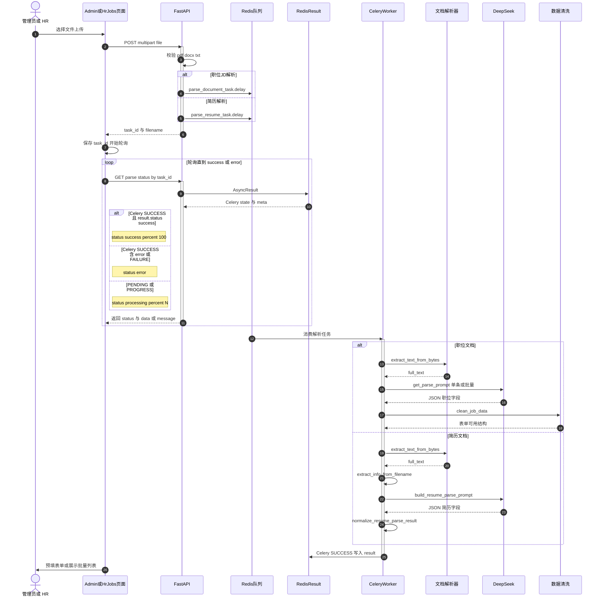

# 文档解析序列图

> 预览：安装 **Markdown Preview Mermaid Support**，打开本文件 `Ctrl+Shift+V`；或复制 `mermaid` 到 [Mermaid Live Editor](https://mermaid.live)。

---

## 30 秒读懂

管理员或 HR 上传 **PDF / DOCX / TXT** → `POST .../parse/submit` 返回 `task_id` → **Celery Worker** 提取文本 → **LLM 结构化 JSON** → 清洗 → 前端轮询 `GET .../parse/status/{task_id}` → 表单预填。

竖线 **激活条** 用 `activate` / `deactivate` 标注生命周期。参与者 ID 用 `SVR`（显示名 FastAPI），**不要用 `API`**。

---

## 文档解析交互序列图

---

## API 路径对照

| 类型 | 提交 | 状态查询 | Celery 任务 |
|------|------|----------|-------------|
| 职位（Admin） | `POST /api/v1/admin/jobs/parse/submit` | `GET .../jobs/parse/status/{task_id}` | `parse_document_task` |
| 职位（HR） | `POST /api/v1/mentor/jobs/parse/submit` | `GET .../jobs/parse/status/{task_id}` | 同上 |
| 简历（Admin） | `POST /api/v1/admin/resumes/parse/submit` | `GET .../resumes/parse/status/{task_id}` | `parse_resume_task` |

---

## Worker 内四步进度（职位解析）

| 进度 | Celery | API status | 动作 |
|------|--------|------------|------|
| 0% | `PENDING` | `processing` | 排队 |
| 25% | `PROGRESS` | `processing` | 提取文本 |
| 50% | `PROGRESS` | `processing` | LLM 解析 |
| 75% | `PROGRESS` | `processing` | 清洗 |
| 100% | `SUCCESS` | `success` 或 `error` | 写入 Redis Result |

简历解析为 3 步：约 30% / 60% / 90%。

---

## 与其它文档

| 文档 | 内容 |
|------|------|
| [function-structure.md](./function-structure.md) | 文档解析在平台能力层的位置 |
| [use-case.md](./use-case.md) | 管理员/HR 解析用例 |
| **本文件** | 上传 → Celery → LLM 时序 |

---

## 文档命名约定

- 文件名：`docs/parse-sequence.md`
- 一级标题：`# 文档解析序列图`
- 图表小节：`## 文档解析交互序列图`
