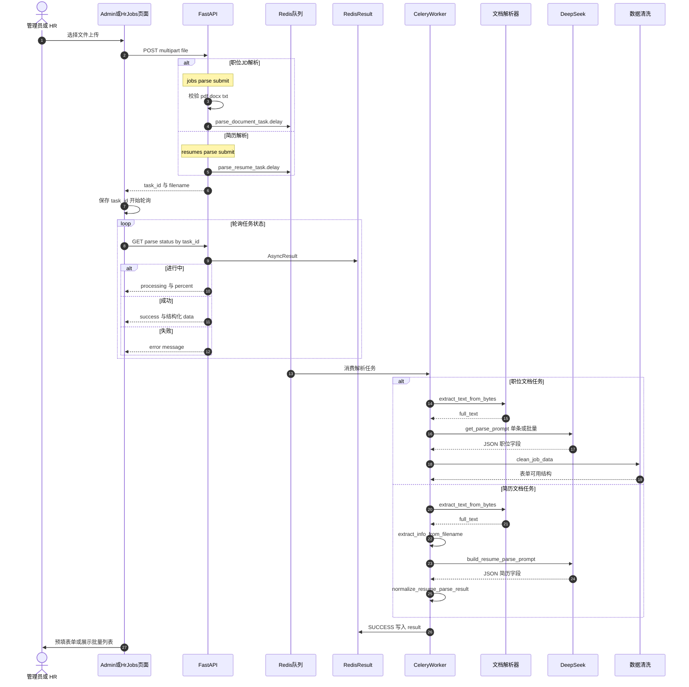

# 文档解析序列图

> 预览：安装 **Markdown Preview Mermaid Support**，打开本文件 `Ctrl+Shift+V`；或复制 `mermaid` 到 [Mermaid Live Editor](https://mermaid.live)。

---

## 30 秒读懂

管理员或 HR 上传 **PDF / DOCX / TXT** → `POST .../parse/submit` 返回 `task_id` → **Celery Worker** 提取文本 → **LLM 结构化 JSON** → 清洗结果 → 前端轮询 `GET .../parse/status/{task_id}` → 管理端表单预填或批量导入。

职位解析与简历解析共用 **submit + poll** 模式，Worker 内任务名不同。

**Mermaid 注意：** 序列图参与者 ID 不要用 `PAR`（会被解析成并行块关键字 `par`）；消息里避免未加引号的 `{task_id}`、`/` 等符号。

---

## 文档解析交互序列图

---

## API 路径对照

| 类型 | 提交 | 状态查询 | Celery 任务 |
|------|------|----------|-------------|
| 职位（Admin） | `POST /api/v1/admin/jobs/parse/submit` | `GET .../jobs/parse/status/{task_id}` | `parse_document_task` |
| 职位（HR） | `POST /api/v1/mentor/jobs/parse/submit` | `GET .../jobs/parse/status/{task_id}` | 同上 |
| 简历（Admin） | `POST /api/v1/admin/resumes/parse/submit` | `GET .../resumes/parse/status/{task_id}` | `parse_resume_task` |

参数说明：

- 职位解析支持 `is_batch=true`（Form 字段），批量 JD 一次解析多条。
- 状态响应由 `build_celery_task_status` 统一格式化。

---

## Worker 内四步进度（职位解析）

| 进度 | 消息 | 动作 |
|------|------|------|
| 25% | 正在提取文档文本 | `extract_text_from_bytes` |
| 50% | 正在调用 AI 分析文档 | LLM + JSON 解析 |
| 75% | 正在整理解析结果 | `clean_job_data_for_response` |
| 100% | 解析完成 | 返回 `{ status: success, result }` |

简历解析为 3 步：提取文本 → AI 解析 → 规范化（约 30% / 60% / 100%）。

---

## 与其它文档

| 文档 | 内容 |
|------|------|
| [function-structure.md](./function-structure.md) | 文档解析在平台能力层的位置 |
| [use-case.md](./use-case.md) | 管理员/HR 解析用例 |
| **本文件** | 上传 → Celery → LLM 的时序 |

---

## 文档命名约定

- 文件名：`docs/parse-sequence.md`
- 一级标题：`# 文档解析序列图`
- 图表小节：`## 文档解析交互序列图`
