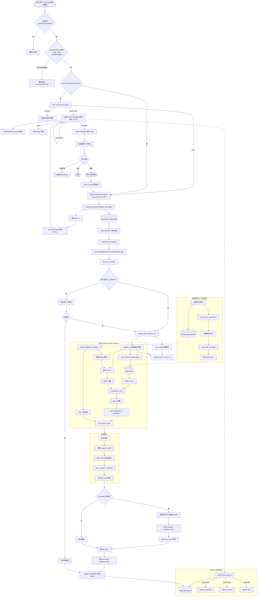

# 职位推荐流程图

> 预览：在 Cursor / VS Code 中安装 **Markdown Preview Mermaid Support**，打开本文件后使用 Markdown 预览（`Ctrl+Shift+V`）。  
> 也可复制下方 `mermaid` 代码块到 [Mermaid Live Editor](https://mermaid.live) 导出 PNG/SVG。  
> 状态转换见 [recommend-state.md](./recommend-state.md)。

**Mermaid 写法注意：** 节点文字里避免未加引号的 `[` `]`、`/`、`:`、`|×` 等，否则会被当成语法解析。公式细节见下方「评分公式」表，图内用简写标签。

---

## 职位推荐功能流程图

---

## 评分公式

| 阶段 | 公式 |
|------|------|
| 混合召回 | `rag_score = BM25_norm×0.3 + FAISS_norm×0.7` |
| 粗排融合 | `final_score = rag_score×0.7 + skill_score×0.3` |
| 技能匹配 | `skill_score = 技能交集数 / 职位技能数` |
| 展示分 | `score = int(final_score × 100)` |

## 主要代码入口

| 环节 | 文件 |
|------|------|
| 前端 | `talentflow-ai-frontend/src/views/user/dashboard/JobCockpit.vue` |
| API | `talentflow-ai-backend-bak/app/api/v1/user/job_recommend.py` |
| Celery 任务 | `talentflow-ai-backend-bak/app/services/recommendation_service.py` |
| 混合检索 | `talentflow-ai-backend-bak/app/rag/retriever.py` |
| 向量 / 精排 | `embeddings.py` / `reranker.py` / `vector_store.py` |

---

## 文档命名约定

后续流程图 Markdown 建议统一命名：

- 文件名：`docs/{模块}-flow.md`（如 `smart-apply-flow.md`）
- 一级标题：`# {功能名}流程图`
- Mermaid 小节标题：`## {功能名}功能流程图`（格式：**xx功能xx图**）
