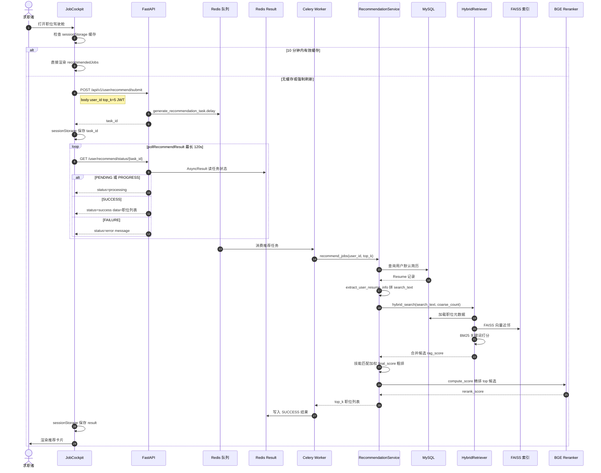

# 职位推荐序列图

> 预览：安装 **Markdown Preview Mermaid Support**，打开本文件 `Ctrl+Shift+V`；或复制 `mermaid` 到 [Mermaid Live Editor](https://mermaid.live)。  
> 配套活动流程图：[recommend-flow.md](./recommend-flow.md)

---

## 30 秒读懂

用户在 **JobCockpit** 打开推荐页 → 前端 `POST recommend/submit` 拿到 `task_id` → **Celery Worker** 读默认简历、混合检索、精排 → 前端轮询 `GET recommend/status/{task_id}` 直到 `success` → 结果写入 `sessionStorage` 并渲染卡片。

---

## 职位推荐交互序列图

---

## Worker 内检索步骤（对照序列图 25～32 步）

| 顺序 | 组件 | 动作 |
|------|------|------|
| 1 | MySQL | 取用户默认简历 |
| 2 | HybridRetriever | BM25 + FAISS 混合召回 `top_k × 5` 条 |
| 3 | RecommendationService | 技能交集算 `skill_score`，与 `rag_score` 融合 |
| 4 | BGE Reranker | 对粗排结果精排 |
| 5 | Celery | 返回 `{ status: success, result: [...] }` |

---

## 关键 API

| 方法 | 路径 | 说明 |
|------|------|------|
| POST | `/api/v1/user/recommend/submit` | 提交异步推荐，返回 `task_id` |
| GET | `/api/v1/user/recommend/status/{task_id}` | 轮询：`processing` / `success` / `error` |

---

## 与其它文档

| 文档 | 区别 |
|------|------|
| [recommend-flow.md](./recommend-flow.md) | 活动图：缓存分支、进度条、评分公式 |
| **本文件** | 序列图：前端 ↔ API ↔ Worker ↔ 检索组件时序 |

---

## 文档命名约定

- 文件名：`docs/recommend-sequence.md`
- 一级标题：`# 职位推荐序列图`
- 图表小节：`## 职位推荐交互序列图`
