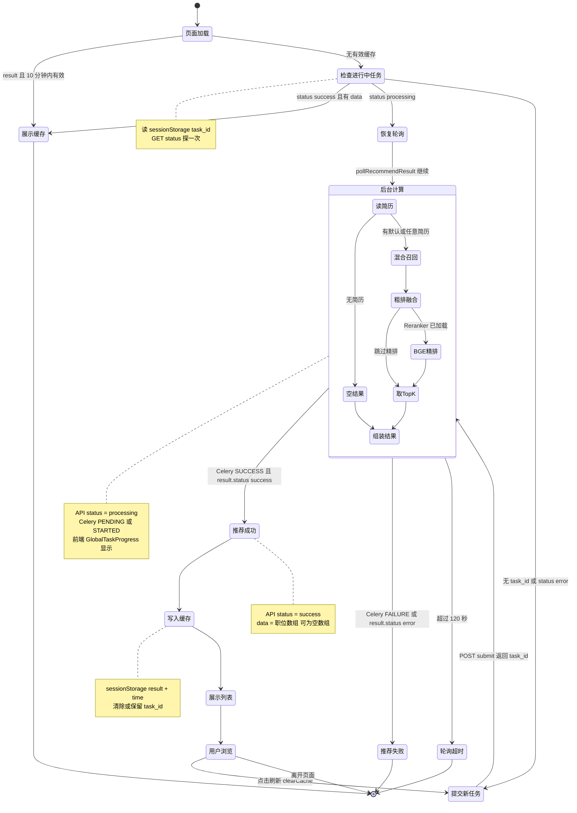

# 职位推荐状态图

> 预览：安装 **Markdown Preview Mermaid Support**，打开本文件 `Ctrl+Shift+V`；或复制 `mermaid` 到 [Mermaid Live Editor](https://mermaid.live)。  
> 配套文档：[recommend-flow.md](./recommend-flow.md)（活动图）· [recommend-sequence.md](./recommend-sequence.md)（序列图）

**Mermaid 注意：** 状态 ID 不要用 `par` 等保留字；标签避免未加引号的 `{}`。

---

## 30 秒读懂

职位推荐 **无数据库任务表**，状态分两层：

| 视角 | 存储 | 状态 |
|------|------|------|
| **前端** | `sessionStorage`（`task_id` / `result` / `time`） | 缓存命中 / 轮询中 / 已展示 |
| **API 轮询** | Celery `AsyncResult` | `processing` / `success` / `error` |
| **Worker 内** | 无持久化 stage | 读简历 → 召回 → 粗排 → 精排 |

与文档解析不同：推荐任务 **不上报 `percent`**，轮询期间 API 固定返回 `status=processing`。

---

## 职位推荐综合状态图

> 对应：`JobCockpit.vue` + `POST /recommend/submit` + `GET /recommend/status/{task_id}` + `generate_recommendation_task`。



---

## 读图：前端 vs API vs Celery

```text
页面加载
   ├─ 10min 缓存有效 ──► 展示缓存 ──► 结束
   └─ 无缓存 ──► 有 task_id?
         ├─ success ──► 写缓存 ──► 展示
         ├─ processing ──► 恢复轮询 ──► 后台计算 ──► success/error
         └─ 无/失败 ──► 提交新任务 ──► 后台计算 ──► success/error
```

---

## 字段对照表

### API `GET /recommend/status/{task_id}`

| status | Celery 条件 | 前端行为 |
|--------|-------------|----------|
| `processing` | `not task_result.ready()` | 继续轮询，进度条 indeterminate |
| `success` | `ready()` 且 result.status=success | 停止轮询，渲染 `data` |
| `error` | `FAILURE` 或 result.status=error | 停止轮询，`ElMessage` 报错 |

### sessionStorage 键（按用户 id 前缀）

| 键 | 含义 |
|----|------|
| `recommend_{userId}_task_id` | 当前 Celery 任务 id |
| `recommend_{userId}_result` | 上次成功推荐的 JSON 数组 |
| `recommend_{userId}_time` | 写入 result 的时间戳（10 分钟 TTL） |

### Celery 返回值

| result.status | 含义 |
|---------------|------|
| `success` | `result` 为职位列表（可能 `[]`） |
| `error` | `message` 为错误说明 |

---

## 三条典型路径

**A. 10 分钟内再次打开（最常见）**

```text
页面加载 ──► 展示缓存 ──► 结束
```

**B. 刷新 / 强制重新推荐**

```text
用户浏览 ──clearCache──► 提交新任务 ──► 后台计算 ──► 推荐成功 ──► 展示列表
```

**C. 关页后任务仍在跑，再回来**

```text
页面加载 ──► 检查进行中任务 ──processing──► 恢复轮询 ──► 推荐成功 ──► 写入缓存
```

---

## 与其它文档

| 文档 | 区别 |
|------|------|
| [recommend-flow.md](./recommend-flow.md) | **怎么做**：检索分支、评分公式 |
| [recommend-sequence.md](./recommend-sequence.md) | **谁调谁**：消息时序 |
| **本文件** | **在什么状态**：前端缓存 + API + Worker |

---

## 文档命名约定

- 文件名：`docs/recommend-state.md`
- 一级标题：`# 职位推荐状态图`
- 图表小节：`## 职位推荐综合状态图`
