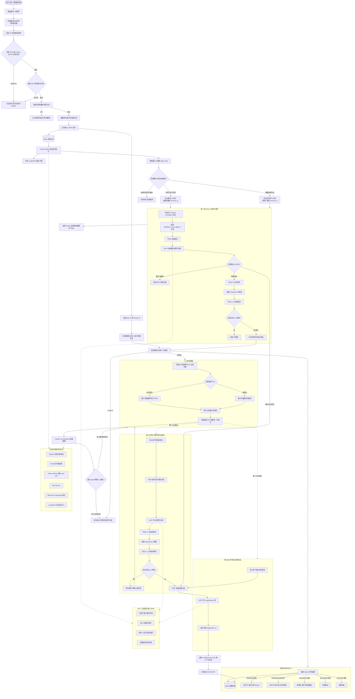

# 智能投递流程图

> 预览：在 Cursor / VS Code 中安装 **Markdown Preview Mermaid Support**，打开本文件后使用 Markdown 预览（`Ctrl+Shift+V`）。  
> 也可复制下方 `mermaid` 代码块到 [Mermaid Live Editor](https://mermaid.live) 导出 PNG/SVG。

---

## 30 秒读懂：智能投递在干什么

用户选中 **一份简历 + 一个职位** 后点「一键投递」，系统会在后台：

1. **读简历**（从数据库经 MCP 取出）
2. **按职位描述 AI 优化简历**（可选；有缓存可跳过）
3. **让你确认**优化后的简历（默认开启）
4. **保存优化版简历** 并 **AI 写求职信**
5. **让你确认**求职信（默认开启）
6. **写入投递记录**（applications 表），完成投递

因为第 3、5 步要等人点确认，**一次投递在后台会分 2～3 段执行**（不是重复跑，是「暂停 → 你确认 → 接着跑」）。

---

## 读图指南：图里几大块分别是什么

| 图上区域 | 中文含义 | 谁在跑 |
|----------|----------|--------|
| 最上方（submit → 轮询） | **前端 + 提交 API**：点投递、拿 task_id、定时查进度 | 浏览器 + FastAPI |
| 中间 `STATUS` 子图 | **查任务状态**：排队中 / 进行中 / 待审核 / 成功 / 失败 | FastAPI 读 Redis |
| `REVIEW_UI` 子图 | **人工审核弹窗**：展示 AI 产物，点「确认并继续」 | 浏览器 + FastAPI |
| `TURN1` 子图 | **第一段 AI 流程**：取简历 → 优化 → 第一次暂停 | **Celery Worker** |
| `TURN2` / `TURN3` | **第二、三段**：保存简历、写信、最终入库 | **FastAPI**（你点确认后） |
| `MCP_SRV` | **工具服务**：替 LangGraph 节点去查库、写库 | 独立进程 `:8002` |
| `DEPS` | **必须一起启动的依赖** | Redis、Worker、MCP 等 |

**实线箭头**：正常下一步。**虚线箭头**：辅助关系或「在别的时间点触发」。

---

## 术语对照（图里英文是什么）

| 术语 | 通俗解释 |
|------|----------|
| **task_id** | Celery 任务编号；前端轮询进度用这个 id |
| **thread_id** | LangGraph 会话编号；**同一次投递**各段共用，checkpoint 靠它续跑 |
| **Celery Worker** | 后台干活的进程；不启动则 submit 会 503，任务一直排队 |
| **MCP Server** | 「数据库助手」服务；图里的节点不直接写 SQL，而是调 MCP 工具 |
| **LangGraph** | 把「取简历→优化→保存→…」编排成 **状态机/工作流** 的框架 |
| **Checkpointer** | 把图执行到一半的状态存进 SQLite；**中断后能接着跑** |
| **interrupt** | 工作流 **故意暂停**，等人确认（不是报错） |
| **astream** | 流式跑图（Celery 里用，边跑边更新进度） |
| **ainvoke** | 一次性跑图（你点「确认继续」后在 FastAPI 里用） |
| **Turn 1/2/3** | LangSmith 监控里的 **三段执行**；对应 1 次 astream + 最多 2 次 ainvoke |
| **localStorage** | 浏览器本地记录未完成任务；刷新页面后会 **接着轮询** 同一个 task_id |
| **UserResumeCache** | 表：某用户某职位 **已优化过的简历 id**；有则 mode=auto 可跳过 AI 优化 |

---

## 用户视角：完整时间线

```text
① 在职位页选简历 → 点「智能投递」
② 前端 POST submit → 立刻拿到 task_id、thread_id（此时 AI 还没跑完）
③ 顶部进度条轮询 status：
      - processing：Worker 正在跑（取简历、优化中…）
      - interrupted：等你审核 → 弹窗出现
④ 弹窗①：看 AI 优化后的简历 → 可改 JSON →「确认并继续」
⑤ 后台 Turn2：保存简历 → AI 写求职信 → 再次 interrupted
⑥ 弹窗②：看求职信 → 可改文字 →「确认并继续」
⑦ 后台 Turn3：写入投递记录 → status 变 success
⑧ 提示「投递成功」，任务从 localStorage 清除
```

若 `.env` 里 `SMART_APPLY_HUMAN_REVIEW=false`，则没有 ④⑤ 弹窗，① 提交后 Worker **一条道跑到底**。

---

## 智能投递功能流程图



> **说明：** 图中 `N7B` 为「跳过优化时」从节点 1 直接到节点 7 的捷径；正常完整路径经 Turn2、Turn3 到达 `N7`。

---

## 图上关键节点中文说明

### 提交前检查（不过就 503 / 404）

| 步骤 | 含义 | 常见失败原因 |
|------|------|--------------|
| Redis + Worker | 后台能不能接任务 | 没开 Celery 窗口 |
| MCP 预检 | 工具服务能不能查简历 | 没开 `python -m mcp_server.server` |
| build_initial_state | 简历 id、缓存是否合法 | 没选简历、force_reuse 却无缓存 |

### LangGraph 七个节点（按顺序）

| 节点 | 中文 | 输入 → 输出 |
|------|------|-------------|
| 1 fetch_resume | 取简历 | 用户 id → 简历正文、原始字段 |
| 2 optimize_resume | AI 改简历 | 简历 + 职位描述 → optimized_resume |
| 3 review_optimized_resume | 审简历 | **暂停**；用户确认后继续 |
| 4 save_optimized_resume | 存优化简历 | optimized_resume → 新 resume_id |
| 5 generate_letter | AI 写求职信 | 简历 + JD → cover_letter |
| 6 review_cover_letter | 审求职信 | **暂停**；用户确认后继续 |
| 7 save_record | 写投递单 | 求职信 + resume_id → application_id |

**捷径：** 若 `skip_generation=true`（复用缓存），节点 1 之后 **跳过 2～6**，直接到节点 7 只创建投递记录（仍会用已有 resume_id）。

### 状态轮询 status 返回值

| status | 用户看到什么 | 该做什么 |
|--------|--------------|----------|
| processing | 进度条在走 | 等待 |
| interrupted | 待审核 / 弹窗 | 打开审核，点确认 |
| success | 投递完成 | 无需操作 |
| error | 失败提示 | 看 message，检查 Worker/MCP 日志 |

---

## 三段执行（LangSmith Turn）详解

| 段 | 何时发生 | 谁执行 | 监控名称 | 跑到哪停 |
|----|----------|--------|----------|----------|
| Turn 1 | 点「投递」后 | Celery | smart_apply_astream | 默认停在「审简历」 |
| Turn 2 | 第一次点确认 | FastAPI | smart_apply_resume | 默认停在「审求职信」 |
| Turn 3 | 第二次点确认 | FastAPI | smart_apply_resume | 跑完，写入 applications |

关闭人工审核后，通常 **只有 Turn 1 一段**，Turn 2/3 不发生。

---

## 投递模式 mode（前端默认 auto）

| mode | 中文 | 行为 |
|------|------|------|
| `auto` | 自动 | 该职位 **有过优化缓存** → 跳过 AI 优化；否则完整生成 |
| `force_generate` | 强制生成 | 无视缓存，一定走 AI 优化 + 写信 |
| `force_reuse` | 强制复用 | 必须用缓存；没有则 **直接失败** |

---

## 为什么要 MCP，不直接在节点里写 SQL？

LangGraph 节点通过 **MCP 工具** 访问数据库，好处是：

- 工具接口固定（读简历、存简历、建申请），节点逻辑更清晰
- MCP 可单独启动、单独测；与 FastAPI、Celery 解耦
- 和智能体 / 外部调用方式统一

本地需单独开：`python -m mcp_server.server`（端口 8002）。

---

## 主要 API（路径前缀 `/api/v1/user`）

| 方法 | 路径 | 中文说明 |
|------|------|----------|
| GET | `smart-apply/readiness` | 自检 Redis、Worker、MCP 是否就绪 |
| POST | `smart-apply/submit` | 提交投递，返回 task_id、thread_id |
| GET | `smart-apply/status/{task_id}` | 查进度；interrupted 时含 review_type |
| GET | `smart-apply/thread/{thread_id}` | 读断点快照（弹窗加载 AI 内容） |
| POST | `smart-apply/thread/{thread_id}/resume` | 确认后续跑；body 可带用户修改 |

---

## 本地开发：最少要开几个窗口

```text
窗口1  Redis
窗口2  MCP Server      python -m mcp_server.server
窗口3  Celery Worker   celery -A app.core.celery_app worker --loglevel=info --pool=solo
窗口4  FastAPI         uvicorn app.main:app --reload --port 8000
```

缺 Worker → submit **503**；缺 MCP → submit **503** 或取简历失败；只有 FastAPI 时 **status 可能一直 200 但任务 PENDING**。

---

## 主要代码入口

| 环节 | 文件 |
|------|------|
| 前端任务与轮询 | `talentflow-ai-frontend/src/utils/smartApplyTaskRunner.js` |
| 审核弹窗 | `talentflow-ai-frontend/src/components/SmartApplyReviewDialog.vue` |
| API | `talentflow-ai-backend-bak/app/api/v1/user/smart_apply.py` |
| Celery 任务 | `talentflow-ai-backend-bak/app/services/smart_apply_service.py` |
| 工作流图定义 | `talentflow-ai-backend-bak/app/agents/graph.py` |
| 各节点实现 | `talentflow-ai-backend-bak/app/agents/nodes.py` |
| 断点续跑 | `talentflow-ai-backend-bak/app/agents/checkpoint_service.py` |
| MCP 工具 | `talentflow-ai-backend-bak/mcp_server/server.py` |

---

## 文档命名约定

- 文件名：`docs/{模块}-flow.md`
- 一级标题：`# {功能名}流程图`
- Mermaid 小节：`## {功能名}功能流程图`
