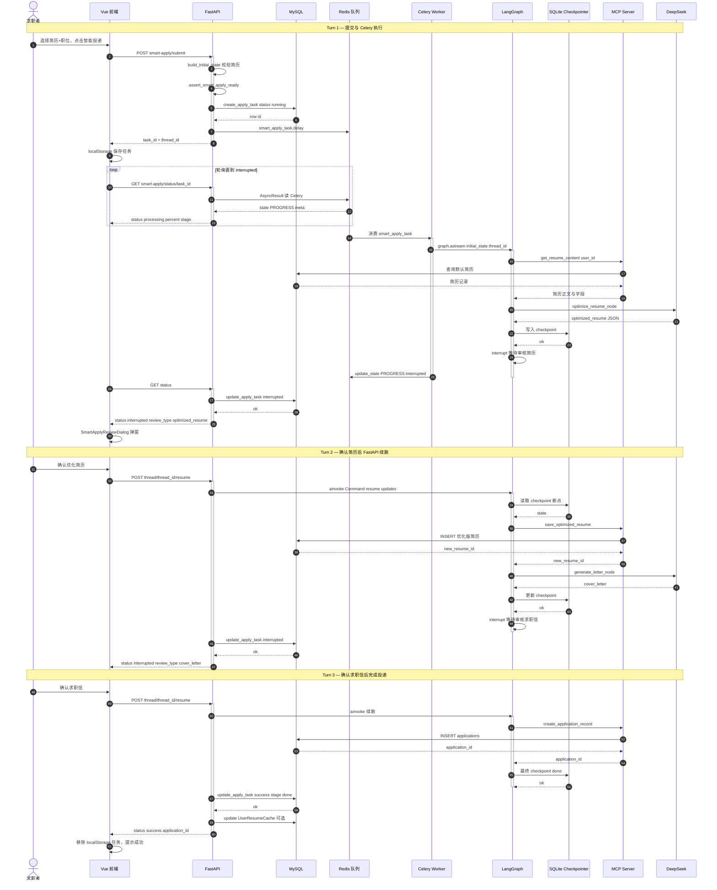

# 智能投递序列图

> 预览：安装 **Markdown Preview Mermaid Support**，打开本文件 `Ctrl+Shift+V`；或复制 `mermaid` 到 [Mermaid Live Editor](https://mermaid.live)。  
> 配套：[smart-apply-flow.md](./smart-apply-flow.md) · [smart-apply-state.md](./smart-apply-state.md)

---

## 30 秒读懂

一次智能投递分 **3 个 Turn**，共用 `thread_id`。竖线 **激活条** 用 `activate` / `deactivate` 标注；后端 ID 为 `SVR`（显示名 FastAPI）。

| Turn | 进程 | 触发 | status 走向 |
|------|------|------|-------------|
| 1 | Celery | `POST .../submit` | `processing` → `interrupted` |
| 2 | FastAPI | `POST .../resume` | `interrupted` → `processing` → `interrupted` |
| 3 | FastAPI | 再次 `.../resume` | `processing` → `success` |

---

## 智能投递交互序列图

---

## 关键 API 与消息

| 步骤 | HTTP | 说明 |
|------|------|------|
| 提交 | `POST /api/v1/user/smart-apply/submit` | 返回 `task_id`、`thread_id` |
| 轮询 | `GET /api/v1/user/smart-apply/status/{task_id}` | `processing` / `interrupted` / `success` / `error` |
| 续跑 | `POST /api/v1/user/smart-apply/thread/{thread_id}/resume` | Body `{ updates: {...} }` |
| 就绪检查 | `GET /api/v1/user/smart-apply/readiness` | Redis / Worker / MCP 是否可用 |

---

## MCP 工具调用一览

| LangGraph 节点 | MCP 工具 | 作用 |
|----------------|----------|------|
| fetch_resume | `get_resume_content` / `get_resume_by_id` | 读用户简历 |
| save_optimized_resume | `save_optimized_resume` | 持久化 AI 优化版 |
| save_record | `create_application_record` | 创建投递记录 |

---

## 与其它文档

| 文档 | 区别 |
|------|------|
| [smart-apply-flow.md](./smart-apply-flow.md) | 活动图：分支与失败场景 |
| [smart-apply-state.md](./smart-apply-state.md) | 状态图：status / stage 字段对照 |
| **本文件** | 序列图：时序 + 激活条生命周期 |

---

## 文档命名约定

- 文件名：`docs/smart-apply-sequence.md`
- 一级标题：`# 智能投递序列图`
- 图表小节：`## 智能投递交互序列图`
