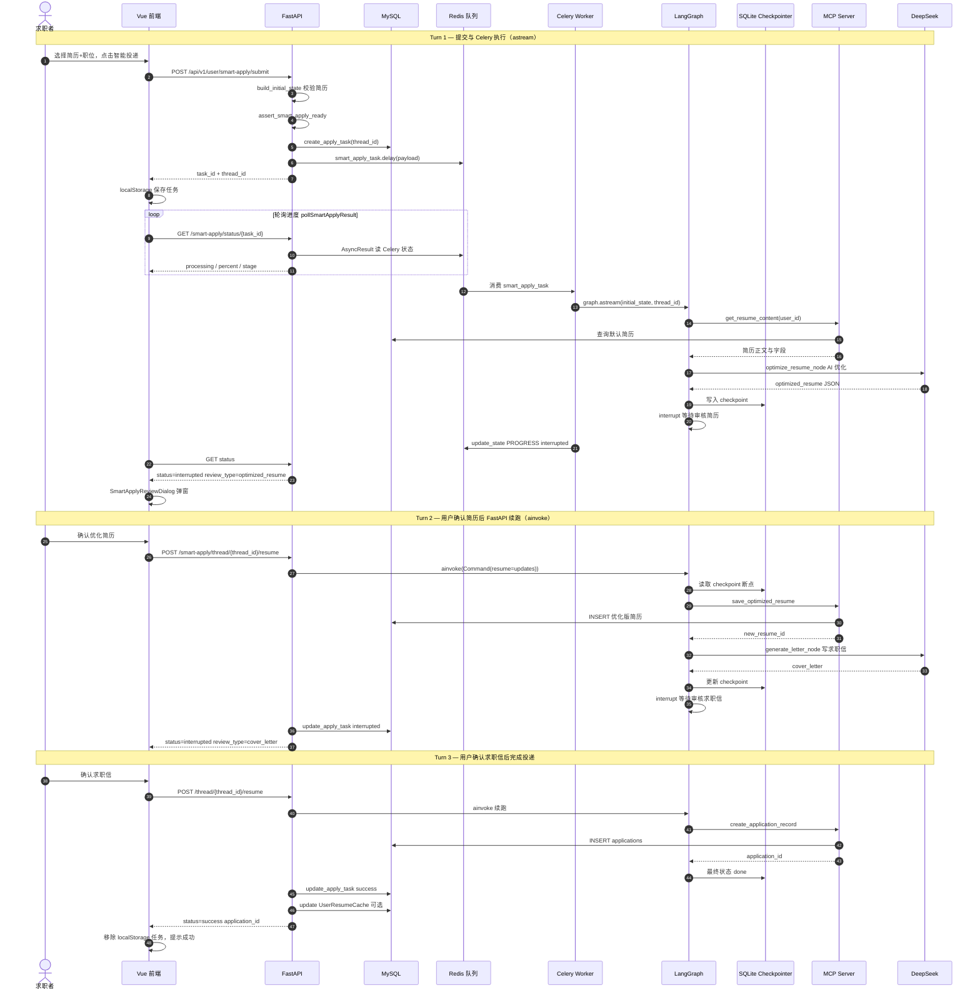

# 智能投递序列图

> 预览：安装 **Markdown Preview Mermaid Support**，打开本文件 `Ctrl+Shift+V`；或复制 `mermaid` 到 [Mermaid Live Editor](https://mermaid.live)。  
> 配套活动流程图：[smart-apply-flow.md](./smart-apply-flow.md)

---

## 30 秒读懂

一次智能投递在时间上分为 **3 段**（LangSmith 里常显示为 2～3 个 Turn）：

| 段 | 执行进程 | 触发方式 | 跑到哪一步 |
|----|----------|----------|------------|
| **Turn 1** | Celery Worker | `POST /smart-apply/submit` | 取简历 → AI 优化 → **暂停等确认简历** |
| **Turn 2** | FastAPI | `POST /thread/{id}/resume` | 保存简历 → 写求职信 → **暂停等确认求职信** |
| **Turn 3** | FastAPI | 再次 `POST .../resume` | 写入投递记录 → 完成 |

同一次投递共用 **`thread_id`**（Checkpointer 续跑）；**`task_id`** 主要用于 Turn 1 轮询 Celery 进度。

---

## 智能投递交互序列图

---

## 关键 API 与消息

| 步骤 | HTTP | 说明 |
|------|------|------|
| 提交 | `POST /api/v1/user/smart-apply/submit` | 返回 `task_id`、`thread_id` |
| 轮询 | `GET /api/v1/user/smart-apply/status/{task_id}` | `processing` / `interrupted` / `success` / `error` |
| 续跑 | `POST /api/v1/user/smart-apply/thread/{thread_id}/resume` | Body: `{ updates: {...} }`，人工确认后调用 |
| 就绪检查 | `GET /api/v1/user/smart-apply/readiness` | Redis / Worker / MCP 是否可用 |

---

## MCP 工具调用一览

| LangGraph 节点 | MCP 工具 | 作用 |
|----------------|----------|------|
| fetch_resume | `get_resume_content` / `get_resume_by_id` | 读用户简历 |
| save_optimized_resume | `save_optimized_resume` | 持久化 AI 优化版 |
| save_record | `create_application_record` | 创建投递记录 |

---

## 与其它文档

| 文档 | 区别 |
|------|------|
| [smart-apply-flow.md](./smart-apply-flow.md) | **活动图**：分支、状态、失败场景 |
| [smart-apply-state.md](./smart-apply-state.md) | **状态图**：API / DB / LangGraph 状态转换 |
| **本文件** | **序列图**：参与者之间按时间的调用顺序 |

---

## 文档命名约定

- 文件名：`docs/smart-apply-sequence.md`
- 一级标题：`# 智能投递序列图`
- 图表小节：`## 智能投递交互序列图`
