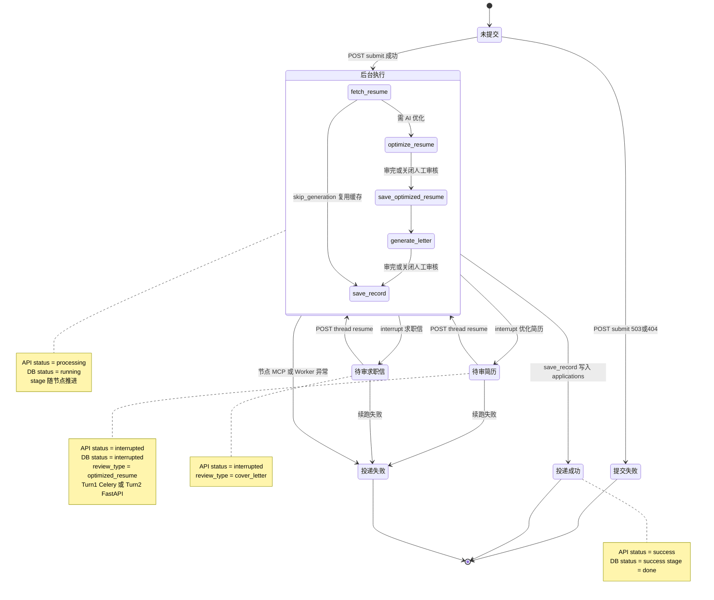

# 智能投递状态图

> 预览：安装 **Markdown Preview Mermaid Support**，打开本文件 `Ctrl+Shift+V`；或复制 `mermaid` 到 [Mermaid Live Editor](https://mermaid.live)。  
> 配套文档：[smart-apply-flow.md](./smart-apply-flow.md)（活动图）· [smart-apply-sequence.md](./smart-apply-sequence.md)（序列图）

**Mermaid 注意：** 状态 ID 不要用 `par` 等保留字；消息标签避免花括号 `{}`。

---

## 30 秒读懂

**一张状态图就够。** 外层是用户/前端看到的任务状态；内层 composite「后台执行」是 LangGraph 节点顺序；**待审简历 / 待审求职信** 是从内层跳出来的 `interrupt`，确认后回到内层接着跑。

数据库 `apply_tasks.status` / `stage` 与 API 字段的对照见文末 **表格**，不必再各画一张图。

---

## 为什么要分三层状态（不是必须画三张图）

系统里确实有三套「状态」概念，但它们是 **同一流程的不同视角**，不是三个独立业务：

| 视角 | 例子 | 在一张图里怎么体现 |
|------|------|-------------------|
| API / 前端 | `processing`、`interrupted` | **外层** 圆角状态 |
| LangGraph 节点 | `fetch_resume` → `optimize` … | **内层** composite 子状态 |
| 数据库字段 | `status` + `stage` | 用 **对照表** 标注，不单独成图 |

若把三层各画成一张，会 **重复同一批箭头**；若硬塞进一张又不分层，状态数会乘起来（例如 `interrupted × optimize`），图会乱。  
**推荐做法：一张综合状态图 + 表格补字段细节**（如下）。

---

## 智能投递综合状态图

> 对应：轮询 `GET /smart-apply/status/{task_id}` + LangGraph `talentflow_smart_apply` + `apply_tasks` 表更新。



---

## 读图：外层 vs 内层

```text
未提交 ──submit──► ┌─ 后台执行 ─────────────────────┐
                   │ fetch → optimize → save → …   │
                   └──────────┬────────────────────┘
                              │ interrupt
                              ▼
                         待审简历 / 待审求职信
                              │ POST resume
                              └──► 回到后台执行下一节点
```

- **外层**：前端进度条、弹窗、`localStorage` 任务只关心是否在「等用户点确认」。
- **内层**：Celery Turn1 与 FastAPI Turn2/3 实际在跑的 LangGraph 节点；`stage` 字段与此基本一一对应。
- **捷径**：复用缓存时内层从 `fetch_resume` 直连 `save_record`；关闭 `SMART_APPLY_HUMAN_REVIEW` 时 review 节点不跳出外层，内层一口气跑完。

---

## 字段对照表（代替另外两张状态图）

### API status → 前端行为

| status | 含义 | 前端动作 |
|--------|------|----------|
| `processing` | 排队或在内层节点执行 | 轮询，`percent` / `stage` 更新 |
| `interrupted` | 在外层「待审*」 | 打开审核弹窗，读 `review_type` |
| `success` | 到达「投递成功」 | 清除 localStorage，提示成功 |
| `error` | 到达「投递失败」 | 清除任务，展示 `message` |

### stage → 内层节点 / 进度

| stage | percent | LangGraph 节点 |
|-------|---------|----------------|
| `pending` | 0 | 任务刚创建 |
| `fetch_resume` | 20 | fetch_resume |
| `optimize` | 40 | optimize + review_optimized |
| `save_resume` | 60 | save_optimized_resume |
| `generate_letter` | 80 | generate + review_cover |
| `save_record` | 95 | save_record |
| `done` | 100 | 结束 |

### apply_tasks.status ↔ 外层状态

| 外层（图中） | DB status |
|--------------|-----------|
| 后台执行 | `running` |
| 待审简历 / 待审求职信 | `interrupted` |
| 投递成功 | `success` |
| 投递失败 | `error` |

### Celery ↔ API（Turn1 轮询时）

| Celery state | 常见 API status |
|--------------|-----------------|
| `PENDING` | `processing` |
| `PROGRESS` | `processing` 或 `interrupted` |
| `SUCCESS` | `interrupted` / `success` / `error` |
| `FAILURE` | `error` |

---

## 三条典型路径

**A. 默认（人工审核 + 完整 AI）**

```text
后台执行 ──► 待审简历 ──► 后台执行 ──► 待审求职信 ──► 后台执行 ──► 投递成功
```

**B. 复用缓存（mode=auto）**

```text
后台执行内 fetch_resume ──直连──► save_record ──► 投递成功
```

**C. 关闭人工审核**

```text
后台执行（内层一口气跑完）──► 投递成功
```

---

## 与其它文档

| 文档 | 区别 |
|------|------|
| [smart-apply-flow.md](./smart-apply-flow.md) | **怎么做**：分支、Turn、MCP |
| [smart-apply-sequence.md](./smart-apply-sequence.md) | **谁调谁**：消息时序 |
| **本文件** | **在什么状态**：一张综合状态图 + 字段表 |

---

## 文档命名约定

- 文件名：`docs/smart-apply-state.md`
- 一级标题：`# 智能投递状态图`
- 图表小节：`## 智能投递综合状态图`
