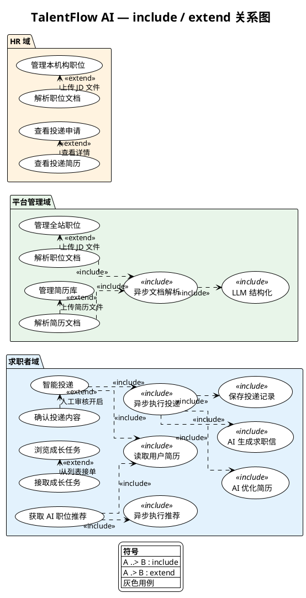

# 系统用例图

> 预览：安装 VS Code 插件 **PlantUML**，打开本文件后 `Alt+D` 预览；或复制 `@startuml`～`@enduml` 到 [PlantUML 在线编辑器](https://www.plantuml.com/plantuml/uml)。

---

## 系统用例功能图

> **主图定位：** 只画 **参与者 → 用例**（谁用什么功能），线条最少、便于汇报。  
> **include / extend 完整关系** 见下一节 **「用例关系图」**（本项目实际有多条，并非只有一个 extend）。

```plantuml
@startuml talentflow-use-case
!theme plain
top to bottom direction
skinparam shadowing false
skinparam linetype ortho
skinparam nodesep 30
skinparam ranksep 40
skinparam PackagePadding 10
skinparam usecase {
  BackgroundColor #FEFECE
  BorderColor #333333
}

title TalentFlow AI — 用例图（参与者视图）

rectangle "TalentFlow AI 智能招聘平台" {

  package "认证" #EEEEEE {
    usecase "登录系统" as UC_Login
    usecase "注册账号" as UC_Register
  }

  together {
    actor "求职者" as Seeker #LightBlue
    package "求职者" #E3F2FD {
      usecase "管理个人简历" as UC_Resume
      usecase "浏览职位列表" as UC_JobList
      usecase "获取 AI 职位推荐" as UC_Recommend
      usecase "智能投递" as UC_SmartApply
      usecase "查看我的投递" as UC_MyApps
      usecase "浏览成长任务" as UC_BrowseTask
      usecase "接取成长任务" as UC_TakeTask
      usecase "查看任务详情" as UC_TaskDetail
    }
  }

  together {
    actor "平台管理员" as Admin #LightGreen
    package "平台管理" #E8F5E9 {
      usecase "查看运营看板" as UC_AdminDash
      usecase "管理用户" as UC_UserMgmt
      usecase "管理全站职位" as UC_AdminJobs
      usecase "管理简历库" as UC_AdminResumes
      usecase "管理项目" as UC_Projects
      usecase "解析职位文档" as UC_ParseJob
      usecase "解析简历文档" as UC_ParseResume
    }
  }

  together {
    actor "HR/导师" as HR #Wheat
    package "HR 导师" #FFF3E0 {
      usecase "查看 HR 工作台" as UC_HRDash
      usecase "管理本机构职位" as UC_HRJobs
      usecase "管理培训任务" as UC_HRTasks
      usecase "查看投递申请" as UC_HRApps
      usecase "查看投递简历" as UC_HRResume
      usecase "处理投递状态" as UC_HRProcess
    }
  }
}

Seeker --> UC_Login
Seeker --> UC_Register
Admin --> UC_Login
HR --> UC_Login

Seeker --> UC_Resume
Seeker --> UC_JobList
Seeker --> UC_Recommend
Seeker --> UC_SmartApply
Seeker --> UC_MyApps
Seeker --> UC_BrowseTask
Seeker --> UC_TakeTask
Seeker --> UC_TaskDetail

Admin --> UC_AdminDash
Admin --> UC_UserMgmt
Admin --> UC_AdminJobs
Admin --> UC_AdminResumes
Admin --> UC_Projects
Admin --> UC_ParseJob
Admin --> UC_ParseResume

HR --> UC_HRDash
HR --> UC_HRJobs
HR --> UC_HRTasks
HR --> UC_HRApps
HR --> UC_HRResume
HR --> UC_HRProcess
HR --> UC_ParseJob

legend right
  |= 说明 |
  | 本图 | 仅参与者与用例关联 |
  | include extend | 见下一节「用例关系图」 |
endlegend

@enduml
```

---

## 用例 include 与 extend 关系图

> **关系图定位：** 不含参与者，专门画 **用例之间** 的 `<<include>>`（必然发生）与 `<<extend>>`（条件下可选）。  
> 虚线箭头：`..>` 表示 include；`.>` 表示 extend（箭头指向 **被扩展** 的主用例）。

---

## 为什么主图里几乎不画 include / extend？

| 原因 | 说明 |
|------|------|
| **UML 两种图画法** | 主图回答「谁用什么」；关系图回答「用例之间怎么拼」 |
| **避免交叉线** | include 若全画在主图，会从推荐/投递跨到右下角「共用能力」，线条杂乱（你上次反馈的问题） |
| **子用例不是菜单** | 「读取用户简历」「异步执行」是 **技术子步骤**，不出现在前端菜单，适合放在关系图 |

---

## 完整 include / extend 一览表

### <<include>>（必然包含）

| 主用例 | 被 include 的用例 | 代码/业务对应 |
|--------|-------------------|---------------|
| 获取 AI 职位推荐 | 读取用户简历 | `get_user_resume` + 拼 search_text |
| 获取 AI 职位推荐 | 异步执行推荐 | `generate_recommendation_task.delay` |
| 智能投递 | 读取用户简历 | MCP `get_resume_content` / `fetch_resume` 节点 |
| 智能投递 | 异步执行投递 | Celery `smart_apply_task` + LangGraph |
| 异步执行投递 | AI 优化简历 | `optimize_resume` 节点 + DeepSeek |
| 异步执行投递 | AI 生成求职信 | `generate_letter` 节点 |
| 异步执行投递 | 保存投递记录 | `save_record` + MCP `create_application_record` |
| 解析职位文档 | 异步文档解析 | `parse_document_task` |
| 解析简历文档 | 异步文档解析 | `parse_resume_task` |
| 异步文档解析 | LLM 结构化 | `get_llm().invoke` + JSON 清洗 |

### <<extend>>（可选扩展）

| 扩展用例 extend → | 主用例 | 触发条件 |
|-------------------|--------|----------|
| 确认投递内容 | 智能投递 | `SMART_APPLY_HUMAN_REVIEW=true`，优化简历/求职信处 **interrupt** |
| 解析职位文档 | 管理全站职位 | 管理员选择 **上传文件** 而非手填表单 |
| 解析职位文档 | 管理本机构职位 | HR 上传 JD 导入 |
| 解析简历文档 | 管理简历库 | 管理员上传简历文件解析 |
| 查看投递简历 | 查看投递申请 | HR 点某条申请 **查看简历详情** |
| 接取成长任务 | 浏览成长任务 | 用户在任务大厅点 **接单**（也可从详情页接，不强制） |

> **说明：** 「注册账号」不是 extend「登录」，两者独立；求职者可以只登录不注册（账号由管理员创建时）。

---

## 外部系统（不在用例椭圆里，但被 include 链调用）

| 系统 | 被哪些 include 链用到 |
|------|------------------------|
| Celery + Redis | 异步执行推荐、异步执行投递、异步文档解析 |
| AI 服务 DeepSeek | 优化简历、生成求职信、LLM 结构化、推荐精排 |
| MCP Server | 读简历、存优化简历、创建投递记录 |
| LangGraph Checkpointer | 智能投递断点续跑（配合 extend 人工审核） |

---

## 参与者说明

| 参与者 | 角色值 | 说明 |
|--------|--------|------|
| **求职者** | 0 | `/dashboard`：简历、推荐、智能投递、任务、投递记录 |
| **平台管理员** | 1 | `/admin`：全站用户/职位/简历/项目/看板 |
| **HR/导师** | 2 | `/hr`：本机构职位、任务、投递处理 |

**图中未画出的外部依赖**（避免线条交叉，见下表）：

| 依赖 | 作用 |
|------|------|
| Celery + Redis | 职位推荐、智能投递、文档解析等异步任务 |
| AI 服务 | LLM 解析文档、优化简历、生成求职信；向量/精排用于推荐 |
| MCP 服务 | 智能投递读写简历与投递记录 |

---

## 用例清单（共 24 项）

### 认证（2）

| 用例 | 主要参与者 | 说明 |
|------|------------|------|
| 登录系统 | 三者 | JWT 登录，按 role 跳转不同端 |
| 注册账号 | 求职者 | `POST /auth/register` |

### 求职者（9 + extend 见关系图）

| 用例 | 说明 | 后端/前端要点 |
|------|------|----------------|
| 管理个人简历 | 增删改、设默认 | `user/resume/*`、ResumeManager |
| 浏览职位列表 | 查看可投职位 | `user/job-list`、JobList |
| 获取 AI 职位推荐 | 异步混合检索 + 精排 | `recommend/submit`、`JobCockpit` |
| 智能投递 | 选简历一键投递，AI 优化并写入申请 | `smart-apply/submit`、LangGraph |
| 查看我的投递 | 我的申请记录与状态 | `user/applications` |
| 浏览成长任务 | 任务大厅列表 | `user/tasks/` |
| 接取成长任务 | 接单 | `POST tasks/{id}/apply` |
| 查看任务详情 | 任务详情页 | TaskDetail |

> 「确认投递内容」是 **extend** 不是独立菜单，见关系图。

### 平台管理（7）

| 用例 | 说明 |
|------|------|
| 查看运营看板 | 用户/职位/简历趋势与分布 |
| 管理用户 | 列表、启停、重置密码、编辑 |
| 管理全站职位 | 全库职位 CRUD、写入向量库 |
| 管理简历库 | 全站简历 CRUD |
| 管理项目 | 项目 CRUD |
| 解析职位文档 | 上传 JD，LLM 结构化（HR 共用） |
| 解析简历文档 | 上传简历，LLM 结构化 |

### HR/导师（6）

| 用例 | 说明 |
|------|------|
| 查看 HR 工作台 | 统计与动态 |
| 管理本机构职位 | 本 HR 发布职位的 CRUD |
| 管理培训任务 | 任务 CRUD |
| 查看投递申请 | 收到的申请列表 |
| 查看投递简历 | 申请关联简历预览 |
| 处理投递状态 | 待沟通/录用/不合适等 |
| 解析职位文档 | 与管理员 **共用** 同一用例（图中只连一条线） |

---

## 两张图怎么配合看

| 图 | 回答的问题 | 线条 |
|----|------------|------|
| **用例图（参与者视图）** | 求职者/管理员/HR 各自能点哪些功能 | 只有实线 |
| **include/extend 关系图** | 推荐、投递、解析等 **内部怎么串** | 虚线 include/extend |

---

## 与流程图文档的关系

| 文档 | 内容 |
|------|------|
| 本文件 | **谁**在系统边界内 **做什么**；**用例间 include/extend** |
| [recommend-flow.md](./recommend-flow.md) | 职位推荐 **怎么做** |
| [smart-apply-flow.md](./smart-apply-flow.md) | 智能投递 **怎么做** |

---

## 文档命名约定

- 文件名：`docs/use-case.md`
- 一级标题：`# 系统用例图`
- 图表小节：`## 系统用例功能图`
