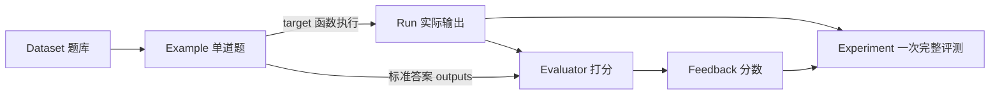
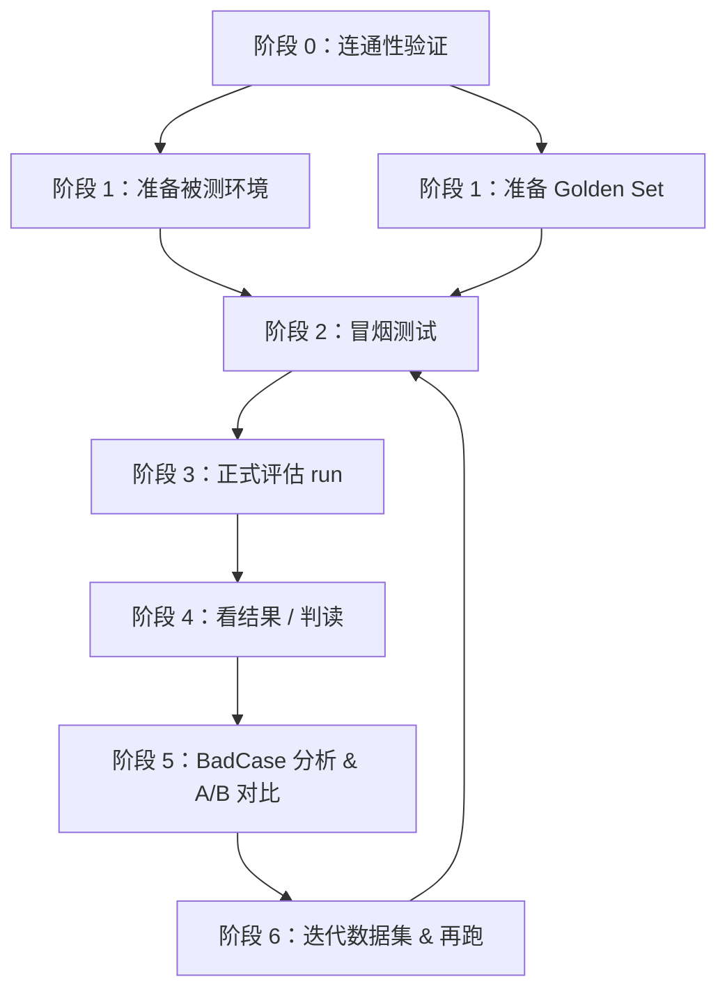
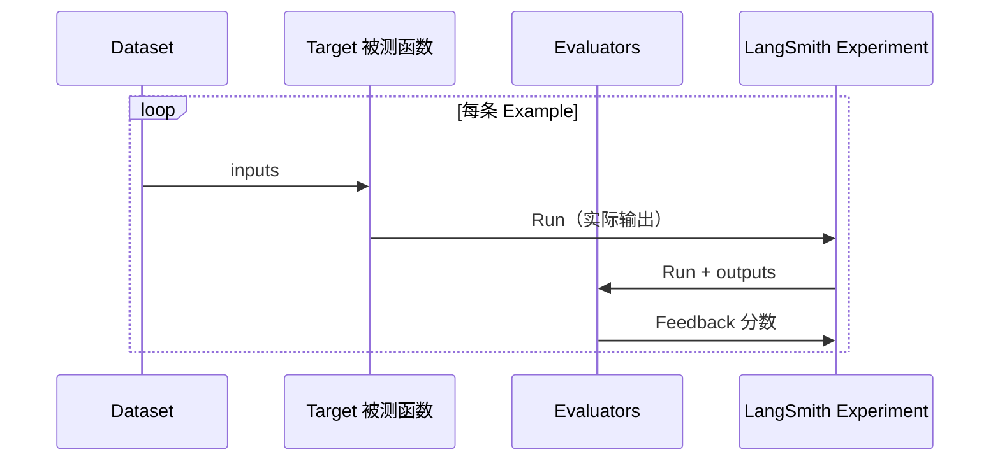
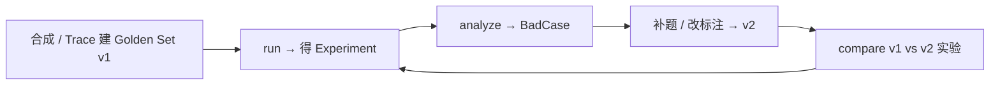

# LangSmith 离线评估流程指南

> 最后更新：2026-06-09  
> 本文档讲**流程与概念**，帮助理解「离线评测到底在干什么、每一步为什么存在」。  
> 本项目的具体命令与实验记录见文末附录。

---

## 一、离线评估解决什么问题

线上系统（RAG 检索、Smart Apply 生成等）每天都在跑，但你需要在**改代码之前**回答：

- 这次改动会让检索更准，还是更差？
- 生成质量是否稳定？有没有格式错误或胡言乱语？
- 哪类 query / 哪类用户输入最容易翻车？

**离线评估**的做法：用一组**固定测试题 + 标准答案（Golden Set）**，在本地或 CI 环境里反复跑被测系统，用**可量化的分数**对比版本差异。

它与**线上 Trace 监控**是两条线：

| | 离线评估 | 线上 Trace |
|---|---------|-----------|
| 数据 | 人工标注 / 半自动扩充的 Golden Set | 真实用户请求 |
| 时机 | 发版前、调参后、做 A/B 对比 | 生产环境持续采集 |
| 目的 | 可复现、可对比、可回归 | 发现线上异常、积累新样本 |
| 平台 | LangSmith **Dataset + Experiment** | LangSmith **Project + Trace** |

两者可以共用同一个 LangSmith 账号，但数据流独立。

---

## 二、LangSmith 里的五个核心概念

先建立词汇表，后面所有步骤都围绕它们转。



| 概念 | 是什么 | 类比 |
|------|--------|------|
| **Dataset** | 一组测试题的容器 | 考试题库 |
| **Example** | 一道题：`inputs`（输入）+ `outputs`（标准答案） | 单道选择题 + 参考答案 |
| **Run** | 对被测系统执行一次 `inputs` 后得到的**实际输出** | 学生的答卷 |
| **Evaluator** | 对比 Run 与 `outputs`，给出分数的函数 | 阅卷规则 / 阅卷老师 |
| **Feedback** | Evaluator 产出的分数（及可选 comment） | 每道题的得分 |
| **Experiment** | 一次完整评测：Dataset 里每道 Example 各产生一条 Run + 若干 Feedback | 一次模考成绩单 |

**Experiment 名 vs Dataset 名 vs ID**

在 LangSmith 网页上，层级通常是：

```
Datasets & Experiments
  └── <Dataset 名>          ← 题库，如 talentflow_golden_set_v1
        └── <Experiment 名>  ← 某次 run 的结果，如 talentflow-rag-v1-full-48152225
```

- 做 **analyze / compare** 时，传的是 **Experiment 名**（页面大标题），不是 Dataset 名，也不是 ID 按钮里的 UUID。
- Dataset 名在 **seed / run** 阶段使用。

---

## 三、完整流程总览（六个阶段）

无论评测 RAG 还是生成类任务，标准流程都类似：



| 阶段 | 在干什么 | 通过标准（直觉） |
|------|----------|------------------|
| **0 连通** | API Key 有效，能读写 LangSmith | 能创建/读取测试 Dataset |
| **1 环境** | 被测系统依赖就绪（DB、索引、模型配置等） | RAG 能搜到东西；生成链路能调通 |
| **1 题库** | Golden Set 上传到 LangSmith Dataset | 网页能看到 N 条 Example |
| **2 冒烟** | 本地快速跑一遍，**不写 Experiment** | 主链路不崩、有基本输出 |
| **3 正式 run** | `langsmith.evaluate` 对每题打分 | 终端显示 Experiment 名；网页有 Feedback |
| **4 判读** | 看各维度均分是否达标 | recall、格式、Judge 分等在预期范围 |
| **5 分析** | 拉出低分样本，做版本对比 | 知道「哪道题、哪个指标」挂了 |
| **6 迭代** | 补题、改标注、从 Trace 扩充 | Golden Set 版本升级 → 再跑 |

**Smoke vs Run 的区别**（很多人第一次会混）：

| | Smoke（冒烟） | Run（正式评估） |
|---|--------------|----------------|
| 目的 | 确认「能跑」 | 确认「跑得好不好」 |
| 是否上传 LangSmith | 通常否 | 是，产生 Experiment |
| 打分严格度 | 宽松（如「至少命中 1 个期望 ID」） | 严格（recall@K、Judge 等完整指标） |
| 成本 | 低 | 较高（尤其含 LLM Judge 时） |

---

## 四、Golden Set 怎么来的

Golden Set 是整个离线评估的**地基**。质量决定你信不信任后面的分数。

### 4.1 三种常见来源

| 来源 | 做法 | 优点 | 缺点 |
|------|------|------|------|
| **人工合成** | 根据业务场景手写 query + 标注期望结果 | 可控、可复现、适合冷启动 | 与真实分布可能有 gap |
| **线上 Trace 抽样** | 从 LangSmith Trace 拉真实请求，人工补标注 | 更贴近生产 | 需脱敏、标注成本高 |
| **历史 Experiment 回流** | 从上一次 run 的低分 / 边界样本扩充 | 针对性强 | 容易过拟合已有失败模式 |

一条 Example 的标准结构：

```json
{
  "inputs": { "query": "深圳 Python 后端 3 年", "top_k": 5 },
  "outputs": { "expected_job_ids": [9001, 9006], "keywords": ["Python", "深圳"] }
}
```

- **inputs**：喂给被测系统的输入，应和线上接口一致。
- **outputs**：标准答案，Evaluator 拿它和 Run 的输出做对比。

### 4.2 RAG 类 vs 生成类，标注什么不同

| 任务类型 | inputs 通常含 | outputs 通常含 |
|----------|--------------|----------------|
| **RAG 检索** | query、top_k | 期望命中的 doc/job ID 列表、关键词 |
| **文本生成** | 简历、JD、任务类型等（尽量自包含） | 质量 rubric、必须出现的关键词、格式约束 |

RAG 还需要**被检索的文档库**在本地就绪（职位进 MySQL、向量进 FAISS 等）——这是「被测环境」，不是 Dataset 的一部分。

---

## 五、正式评估（run）内部发生了什么

`langsmith.evaluate` 是 LangSmith 提供的批量评测入口。理解它的循环，就理解了整个 run 阶段：

```
对 Dataset 中每条 Example：
  1. 取 inputs
  2. 调用 target function（被测代码）→ 得到 Run 输出
  3. 对每个 Evaluator：
       输入 = Run 输出 + Example.outputs（标准答案）
       输出 = Feedback（0~1 或自定义分数 + comment）
  4. 所有 Run + Feedback 归档到同一个 Experiment
```



### 5.1 Target function 是什么

**被测系统的「最小可调用封装」**——输入和线上一致，内部走同一套检索/生成逻辑，但不走 HTTP、不走 Celery 等外围。

- RAG：混合检索 → 返回 `[{id, title, score, passage}, ...]`
- Smart Apply：直接调生成节点 → 返回求职信或优化后简历

Smoke 和 Run 通常共用同一个 target，只是 Run 额外挂载 Evaluators。

### 5.2 Evaluator 分两类

| 类型 | 例子 | 特点 |
|------|------|------|
| **客观指标** | recall@K、precision@K、格式校验、语义相似度 | 确定性、无 API 成本、可自动化 |
| **LLM-as-Judge** | 相关性 1–5 分、HR 视角质量 0/1 | 能评「好不好读」，但有成本与波动 |

典型策略：**先用客观指标建立基线（`--no-judge`），再加 Judge 看语义边界**。

### 5.3 在 LangSmith 网页上怎么看结果

1. 进入 **Datasets & Experiments** → 选 **Dataset 名**
2. 切到 **Experiments** 标签 → 点某次 **Experiment 名**
3. 表格每行 = 一道 Example：
   - 左：inputs
   - 中：Run 输出（系统实际返回）
   - 右：各 Feedback 列（recall_at_k、relevance_score 等）

看**列均值**判断整体；点单行看**具体失败原因**（Judge comment、未命中的 ID 等）。

---

## 六、指标怎么理解（不绑定具体实现）

### 6.1 RAG 检索常用指标

| 指标 | 含义 | 直觉 |
|------|------|------|
| **recall@K** | 期望 ID 中有多少出现在 top-K 结果里 | 「该找到的找到了吗」 |
| **precision@K** | top-K 结果中有多少是期望 ID | 「返回的前 K 条有多干净」 |
| **valid_format** | 输出结构是否符合 schema | 「接口有没有崩格式」 |
| **semantic_similarity** | 返回文本与期望内容的向量相似度 | 召回 ID 对但文本偏了时有用 |
| **relevance_score（Judge）** | LLM 评 1–5 分：技术栈 / 职级 / 地域是否匹配 | 「人眼看算不算相关」 |

recall 和 precision 的区别（一句话）：

> recall 关心「漏了多少该找的」；precision 关心「返回里掺了多少不该有的」。

多期望 ID 的题上，precision@K 往往低于 recall@K——这是正常现象。

### 6.2 生成类常用指标

| 指标 | 含义 |
|------|------|
| **valid_format** | 字数、JSON 结构、关键字段是否合规 |
| **quality_judge** | LLM 按 rubric 判 0/1（像 HR 审阅） |
| **must_mention_keywords** | 是否覆盖必须出现的关键词（可选） |

### 6.3 什么叫 BadCase

BadCase = 某条 Example 在某个关键 Feedback 上**低于阈值**的样本。

常见阈值思路：

| Feedback | 视为失败 |
|----------|----------|
| recall@K | < 1.0（期望全命中） |
| valid_format | < 1.0 |
| relevance_score | < 0.6（5 分制约 3 分以下） |
| quality_judge | < 1.0 |

BadCase 分析的目的不是看「总共几分」，而是**定位可行动的失败模式**：

- 某类地域 query 全挂 → 检查地域解析
- Judge 分低但 recall 高 → 返回对了但描述文本不相关
- 格式全过、Judge 全挂 → 生成内容质量问题

---

## 七、阶段 5：分析与版本对比

### 7.1 analyze — 拉出 BadCase 清单

输入：**Experiment 名**  
输出：各维度均分 + 低分样本列表（query、期望、实际返回、失败指标）

用途：给研发一张「待修清单」，而不是只看一个总分。

### 7.2 compare — A/B 实验对比

输入：**baseline Experiment** + **candidate Experiment**  
输出：各 Feedback 维度的均值 diff（谁升谁降）

典型场景：

- 调了 BM25/FAISS 权重 → baseline vs candidate
- 加了 LLM Judge → 客观指标版 vs 完整版（看 Judge 是否引入新信息）
- 换了 embedding 模型 → 前后 recall / semantic 变化

对比时确保：**同一个 Dataset 版本、同一套 Evaluator**，否则 diff 没有意义。

---

## 八、数据集与实验的迭代闭环

离线评估不是「跑一次就完」，而是一个闭环：



| 动作 | 何时做 |
|------|--------|
| 从 Trace 抽样本 | Golden Set 与线上分布差距大时 |
| 人工复审 `expected_job_ids` | Trace 半自动预标注后必做 |
| 升级 Dataset 版本（v1→v2） | 修正错标、补充边界 case 后 |
| 重新 seed + run | Dataset 内容变更后（**run 读云端 Dataset，不读本地 JSON**） |

---

## 九、成本与常见坑

### 9.1 哪里会花钱 / 花 API 配额

| 步骤 | LangSmith API | LLM 调用 |
|------|---------------|----------|
| setup / seed | 少量 | 无 |
| smoke（检索类） | 无 | 无 |
| smoke（生成类） | 无 | **有** |
| run 仅客观指标 | 有 | 无 |
| run 含 Judge | 有 | **每条 Example 一次 Judge** |
| run 生成 + Judge | 有 | **生成 + Judge 各一次** |

建议路径：先 `--no-judge` 确认 recall/格式 → 再加 Judge → 最后才跑全量 Smart Apply。

### 9.2 常见失败与对应阶段

| 现象 | 大概率原因 | 回到哪一阶段 |
|------|-----------|-------------|
| API Key 报错 | 环境变量未配 | 阶段 0 |
| 召回为空 | 文档库/索引未就绪 | 阶段 1 环境 |
| run 找不到 Dataset | 未 seed 或名字不一致 | 阶段 1 题库 |
| 改了 JSON 但 run 结果不变 | run 读 LangSmith 云端，未重新 seed | 阶段 1 题库 |
| analyze 报 Project not found | 传了 UUID 或 Dataset 名，而非 Experiment 名 | 阶段 5 |
| Judge 全 0 | Judge API Key 无效或返回不可解析 | 阶段 3 |
| `[skip] Dataset 已有 Example` | 非错误；要覆盖需显式 replace | 阶段 1 题库 |

---

## 十、推荐首次跑通顺序（心智模型）

不必记命令，记住**顺序逻辑**即可：

```
1. 验证能连 LangSmith
2. 准备被测环境（RAG 要文档库，生成类要模型 Key）
3. 上传 Golden Set → 网页确认 Example 数量
4. 本地 smoke → 确认主链路通
5. 正式 run（先客观指标，再加 Judge）
6. 网页看 Experiment 各列均分
7. analyze 拉 BadCase → 决定改代码还是改数据集
8. 改完再 run → compare 看有没有变好
```

---

## 附录 A：本项目命令速查

工作目录：`talentflow-ai-backend-bak`，conda 环境 `smart-customer-rag`。

```powershell
# 阶段 0–1
python scripts/eval/cli.py setup
python scripts/eval/cli.py import-jobs          # 仅 RAG
python scripts/eval/cli.py seed --pipeline rag

# 阶段 2–3
python scripts/eval/cli.py smoke --pipeline rag --all
python scripts/eval/cli.py run --pipeline rag --no-judge --prefix talentflow-rag-v1-baseline
python scripts/eval/cli.py run --pipeline rag --prefix talentflow-rag-v1-full

# 阶段 5
python scripts/eval/cli.py analyze --experiment "talentflow-rag-v1-full-48152225" --out scripts/eval/docs/rag_badcases.json
python scripts/eval/cli.py compare --baseline "<baseline实验名>" --candidate "<candidate实验名>"
```

PowerShell 多行续行用反引号 `` ` ``，不要用 Linux 的 `\`。

---

## 附录 B：本项目数据文件

| 用途 | 文件 |
|------|------|
| RAG 被检索职位（13 条，ID 9001–9013） | `datasets/seed_eval_jobs.sql` |
| RAG 测试题 v1 / v2 | `datasets/talentflow_golden_set_v1.json`、`v2.json` |
| Smart Apply 测试题 | `datasets/smart_apply_golden_set_v1.json` |
| 实验基线记录 | [BASELINE_COMPARISON.md](./BASELINE_COMPARISON.md) |

---

## 附录 C：相关链接

- [langsmith-eval-production-plan.md](./langsmith-eval-production-plan.md) — **生产方案**（Trace 回流、策略对比、Dataset 迭代）
- LangSmith 控制台：https://smith.langchain.com
- LangSmith Evaluate 文档：https://docs.smith.langchain.com/evaluation
