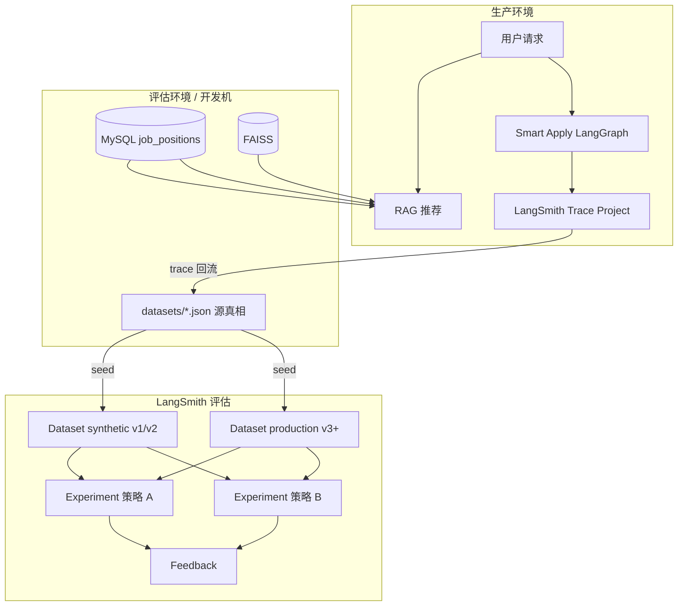
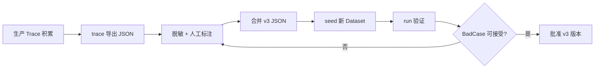
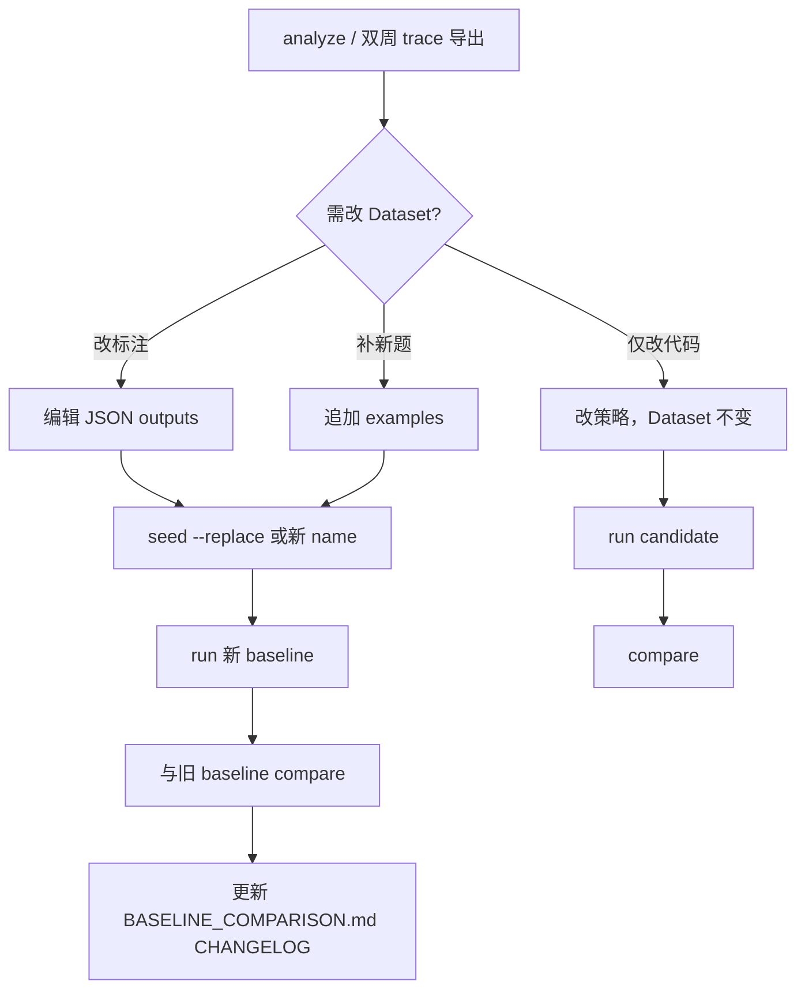

# TalentFlow LangSmith 评估生产方案

> 最后更新：2026-06-09  
> 适用范围：RAG 职位推荐、Smart Apply 生成质量  
> 相关文档：[langsmith-eval-guide.md](./langsmith-eval-guide.md)（流程概念）、[BASELINE_COMPARISON.md](./BASELINE_COMPARISON.md)（实验台账）

本文档定义 **从合成基线 → 生产数据采集 → 策略对比 → Dataset 迭代** 的完整生产方案，可直接按阶段落地。

---

## 一、目标与原则

### 1.1 目标

| 目标 | 说明 |
|------|------|
| **可回归** | 改检索/生成/Prompt 前后，用同一 Dataset 量化对比，避免 silent regression |
| **可演进** | Dataset 从合成集逐步混入生产 Trace，贴近真实分布 |
| **可决策** | 策略 A/B 用 Experiment + Feedback 说话，不靠主观感受 |
| **可审计** | 实验名、Dataset 版本、CHANGELOG 可追溯 |

### 1.2 核心原则

1. **本地 JSON 是 Dataset 源真相**；LangSmith Dataset 是运行副本（`seed` 同步）。
2. **比策略时 Dataset 固定**；**改标注、补生产题时 Dataset 迭代**（新 minor 版本或新 Dataset 名）。
3. **合成集永远保留**作快速冒烟；**生产集单独命名**，不覆盖 v1/v2 合成基线。
4. **自动预标注必须人工复审**（尤其 RAG 的 `expected_job_ids`）。
5. **改 Dataset 后必须重跑 baseline Experiment**，再与后续策略实验 compare。

---

## 二、总体架构



### 2.1 数据分层

| 层级 | 内容 | 存储 | 生命周期 |
|------|------|------|----------|
| L0 合成种子 | eval 职位 9001–9013 | SQL + MySQL + FAISS | 开发回归专用 |
| L1 合成 Golden | v1/v2 JSON | Git + LangSmith Dataset | 长期保留 |
| L2 生产 Golden | v3+ JSON，含真实 query/投递 | Git + LangSmith Dataset | 持续 append |
| L3 实验结果 | Experiment + Feedback | LangSmith | 按实验名归档 |
| L4 分析报告 | BadCase / compare MD | `scripts/eval/docs/` | Git 版本管理 |

### 2.2 两条 Pipeline

| Pipeline | 生产 Trace（当前） | 生产 Dataset 主输入 | 核心 Feedback |
|----------|-------------------|---------------------|---------------|
| **RAG** | ❌ 未接入（待补） | 人工 query + 标 `expected_job_ids`；或日志表导出 | recall、precision、semantic、Judge |
| **Smart Apply** | ✅ `LANGSMITH_TRACING` + Celery | `trace --source smart_apply` + 人工 rubric | valid_format、Judge |

---

## 三、阶段规划

| 阶段 | 名称 | 交付物 | 状态 |
|------|------|--------|------|
| P0 | 评估基础设施 | setup 通过、合成 Dataset seed、baseline Experiment | ✅ 已有 |
| P1 | 合成基线固化 | v2 复审、BASELINE_COMPARISON 台账 | ✅ 已有 |
| P2 | 生产 Trace 采集 | Smart Apply 生产开 Trace；RAG 落库或 Trace（待建） | 🔶 部分 |
| P3 | 生产 Dataset v3 | 首批生产 Example + 人工标注 | 📋 本方案 |
| P4 | 策略对比常态化 | 改代码必 compare、合格线 | 📋 本方案 |
| P5 | Dataset 迭代闭环 | 双周 trace 回流 + BadCase 补题 | 📋 本方案 |
| P6 | CI 门禁（可选） | PR 触发 smoke / run --no-judge | 未做 |

---

## 四、评估流程（生产节奏）

### 4.1 日常/发版前检查清单

**RAG（改 retriever / 向量库 / 精排）**

```powershell
cd talentflow-ai-backend-bak

# 1. 环境（eval 职位或全库，视 Dataset 而定）
python scripts/eval/cli.py import-jobs          # 仅合成集需要

# 2. 本地冒烟（不花钱、不写 LangSmith）
python scripts/eval/cli.py smoke --pipeline rag --all

# 3. 合成集回归（客观指标，快）
python scripts/eval/cli.py run --pipeline rag --no-judge `
  --dataset talentflow_golden_set_v2 `
  --prefix talentflow-rag-regression

# 4. 生产集回归（若已有 v3）
python scripts/eval/cli.py run --pipeline rag --no-judge `
  --dataset talentflow_golden_set_v3_production `
  --prefix talentflow-rag-prod-regression

# 5. 与 baseline compare
python scripts/eval/cli.py compare `
  --baseline "<上次批准的 baseline 实验全名>" `
  --candidate "<本次 regression 实验全名>" `
  --out scripts/eval/docs/compare_$(Get-Date -Format yyyyMMdd).md

# 6. BadCase
python scripts/eval/cli.py analyze --experiment "<本次实验全名>" `
  --out scripts/eval/docs/rag_badcases.json
```

**Smart Apply（改 nodes / prompt）**

```powershell
python scripts/eval/cli.py smoke --pipeline smart_apply --task all
python scripts/eval/cli.py run --pipeline smart_apply `
  --prefix talentflow-sa-regression
python scripts/eval/cli.py analyze --experiment "<实验全名>"
```

### 4.2 合格线（建议，可按业务调整）

#### 合成集 `talentflow_golden_set_v2`（门禁较严）

| 指标 | 合格线 | 说明 |
|------|--------|------|
| `valid_format` | 均分 = 1.0 | 输出结构不能坏 |
| `recall_at_k` | 均分 = 1.0 | 合成标注与检索一致 |
| `precision_at_k` | 均分 ≥ 0.6 | 多期望 ID 时允许低于 recall |
| `semantic_similarity_avg` | 均分 ≥ 0.65 | 与 `EVAL_SEMANTIC_THRESHOLD` 一致 |
| BadCase 数 | 0 | analyze 无低分样本 |

#### 生产集 `v3_production`（门禁较松，逐步收紧）

| 指标 | 初期合格线 | 成熟期目标 |
|------|-----------|-----------|
| `recall_at_k` | 均分 ≥ 0.85 | ≥ 0.92 |
| `relevance_pass` | 均分 ≥ 0.70 | ≥ 0.85 |
| BadCase 占比 | < 20% | < 10% |

#### Smart Apply

| 指标 | 合格线 |
|------|--------|
| `valid_format` | 均分 = 1.0 |
| `letter_quality_judge` / `resume_quality_judge` | 均分 ≥ 0.80 |

**未达合格线**：禁止合并/部署（人工门禁）；或记录例外理由写入 compare 报告。

---

## 五、生产 Dataset 与 Trace 回流

### 5.1 Smart Apply（可立即执行）

#### 前置条件

| 项 | 配置 |
|----|------|
| 生产 `.env` | `LANGSMITH_TRACING=true`、`LANGSMITH_API_KEY` |
| Project | `LANGSMITH_PROJECT=talentflow-smart-apply`（默认） |
| Worker | Celery 启动且 `setup_langsmith_tracing()` 生效 |
| 流量 | 真实或灰度用户完成至少 N 次成功投递 |

#### 回流 SOP（建议双周一次）



**命令**

```powershell
# Step 1: 导出（不写 LangSmith）
python scripts/eval/cli.py trace --source smart_apply --limit 30 `
  --out scripts/eval/datasets/traces_export_smart_apply.json

# Step 2: 人工处理（见 5.3 标注规范）
# 编辑 JSON，合并到 talentflow_golden_set_v3_production.json

# Step 3: 上传新 Dataset（新 name，不覆盖 v1）
python scripts/eval/cli.py seed --pipeline smart_apply `
  --file talentflow_golden_set_v3_production.json

# Step 4: 或直接 append（小批量）
python scripts/eval/cli.py trace --source smart_apply --limit 10 `
  --upload --dataset smart_apply_golden_set_v3_production
```

**Trace 转化逻辑**（`core/traces.py`）：

- 从 Project `talentflow-smart-apply` 拉 `status=success` 的 root run
- 用 metadata `user_id` / `job_id` 回查 MySQL 补简历与 JD
- `outputs.must_mention_keywords`、`quality_rubric` **留空**，必须人工补

### 5.2 RAG（需先建数据源）

当前 **生产推荐未接 LangSmith Trace**，`trace --source eval_rag` 只能从**评估 Experiment** 预标注，不是生产流量。

#### 推荐路线（按优先级）

| 优先级 | 方案 | 工作量 | 说明 |
|--------|------|--------|------|
| P0 | **人工收集 + 标注** | 低 | 20–30 条真实 search_text/query，HR 标 `expected_job_ids` |
| P1 | **推荐日志表** | 中 | 表 `recommend_logs(user_id, query_text, retrieved_ids, created_at)` + 导出脚本 |
| P2 | **RAG 生产 Trace** | 中 | retriever 包 LangSmith callback，新 project `talentflow-rag-prod` |
| P3 | **弱标签挖掘** | 中 | 从 `applications` 投递记录反推用户感兴趣的 job_id（仅作候选） |

#### RAG 生产集 JSON 模板

```json
{
  "name": "talentflow_golden_set_v3_production",
  "description": "生产来源 query，人工标注 expected_job_ids。\nCHANGELOG:\n- 2026-06-09: 首批 25 条",
  "examples": [
    {
      "inputs": {
        "query": "（来自真实简历 search_text 或用户反馈）",
        "top_k": 5
      },
      "outputs": {
        "expected_job_ids": [101, 205],
        "keywords": ["Python", "深圳"],
        "source": "production",
        "annotator": "姓名",
        "annotated_at": "2026-06-09",
        "annotation_note": "用户最终投递了 101；205 为同栈高匹配"
      }
    }
  ]
}
```

**注意**：生产集 `expected_job_ids` 指向 **真实 `job_positions.id`**，不依赖 eval-9001 种子；`import-jobs` 仅合成回归需要。

#### RAG 半自动预标注（辅助，不可直接上线）

```powershell
# 对已有合成/生产 query 跑完 eval 后，从 Experiment 抽 Top-2 作草稿
python scripts/eval/cli.py trace --source eval_rag `
  --experiment "talentflow-rag-v1-full-20260608-xxxxx" `
  --out scripts/eval/datasets/traces_export_rag_draft.json
# 必须人工改 expected_job_ids 后再合并 v3
```

### 5.3 人工标注规范

#### RAG `expected_job_ids`

- 允许多个正确答案（与 v1 相同）
- 必须写 `annotation_note` 说明理由
- 边界 case 单独成条：远程/现场、应届/资深、全栈/专栈
- 职位下线或 JD 大改 → 更新或删除该 Example

#### Smart Apply `outputs`

| 字段 | 要求 |
|------|------|
| `quality_rubric` | 可执行、Judge 能据此打 0/1 |
| `must_mention_keywords` | 3–5 个，来自 JD 硬要求 |
| `must_preserve_name` | optimize_resume 必填 |
| `reference_cover_letter` | 可选；仅当人审确认为「合格范文」 |

#### 脱敏

导出 Trace 后删除或替换：手机号、邮箱、身份证、真实公司敏感信息；姓名可化名但 `must_preserve_name` 与 inputs 一致。

---

## 六、策略对比实验

### 6.1 何时做对比

| 场景 | 固定什么 | 变什么 | 命令 |
|------|----------|--------|------|
| 调 BM25/FAISS 权重 | Dataset + evaluators | retriever 代码/配置 | 两次 `run` + `compare` |
| 换 embedding 模型 | Dataset | 向量库重建 | 同上 |
| 改 Smart Apply prompt | Dataset | `nodes.py` prompt | 同上 |
| 加/去 LLM Judge | Dataset | `--no-judge` vs 默认 | 同上 |
| 合成 vs 生产难度 | 策略代码 | Dataset v2 vs v3 | 同 prefix 不同 dataset |

### 6.2 实验命名规范

```
{pipeline}-{purpose}-{dataset版本}-{YYYYMMDD}-{git短hash可选}

示例：
  talentflow-rag-regression-v2-20260609
  talentflow-rag-prod-v3-20260609
  talentflow-rag-weight-07-03-v2-20260609    # 权重 0.7/0.3 实验
  talentflow-sa-prompt-v2-20260609
```

**规则**

- `baseline`：当前生产批准版本的一次 run，写入 BASELINE_COMPARISON.md
- `candidate`：待合并分支的 run
- 同一对比必须 **同一 Dataset、同一 evaluator 集合**

### 6.3 对比 SOP

```powershell
# 1. 固定 Dataset，跑 baseline（已批准可跳过）
python scripts/eval/cli.py run --pipeline rag --no-judge `
  --dataset talentflow_golden_set_v2 `
  --prefix talentflow-rag-baseline-v2

# 2. 改代码后跑 candidate
python scripts/eval/cli.py run --pipeline rag --no-judge `
  --dataset talentflow_golden_set_v2 `
  --prefix talentflow-rag-candidate-weight-tune

# 3. 对比（从终端或 LangSmith UI 复制实验全名）
python scripts/eval/cli.py compare `
  --baseline "talentflow-rag-baseline-v2-20260609-xxxxx" `
  --candidate "talentflow-rag-candidate-weight-tune-20260609-xxxxx" `
  --out scripts/eval/docs/rag_weight_tune_compare.md

# 4. 决策
# - Δ recall/precision 全 ≥ 0 → 可合并，更新 baseline 台账
# - 有负向 Δ → 回滚或继续调参
# - Judge 维度单独看 relevance_pass，不与 recall 混谈
```

### 6.4 对比解读要点

| 现象 | 解读 | 行动 |
|------|------|------|
| recall ↑ precision ↓ | 召回了更多但噪声增加 | 调精排或提高 precision 权重 |
| recall ↓ semantic ↑ | 标的可能错或检索过窄 | 先 analyze + 人工复审标注 |
| 合成集全 1.0，生产集差 | 合成太理想 | 加大 v3 生产集权重 |
| Judge pass ↓ format OK | 内容质量/相关性 | 改 prompt 或 rubric |

---

## 七、Dataset 迭代

### 7.1 版本策略

| 版本 | Dataset 名 | 用途 | 迭代方式 |
|------|-----------|------|----------|
| v1 | `talentflow_golden_set_v1` | 历史基线 | 冻结，仅只读参考 |
| v2 | `talentflow_golden_set_v2` | **合成回归主集** | 小修 `--replace`；大改用 v2.1 新 name |
| v3 | `talentflow_golden_set_v3_production` | **生产主集** | append 为主 |
| v3-sa | `smart_apply_golden_set_v3_production` | SA 生产集 | trace 回流 + 人工 |

**并存**：发版前 **合成 v2 必跑**；有 v3 时 **生产 v3 必跑**。

### 7.2 迭代触发条件

| 触发 | 动作 |
|------|------|
| analyze 出现新 BadCase 类型 | 保留或修正 Example；必要时新增 |
| 生产 Trace 积累 ≥ 20 条成功 case | trace 回流一批 |
| 标注错误确认 | 改 JSON → `seed --replace`（同版本）或 bump 版本 |
| 策略大改（换模型/换索引） | 全量重跑 baseline，更新台账 |
| 职位库大更新 | 复审 v3 中 `expected_job_ids` |

### 7.3 迭代 SOP



**CHANGELOG 写法**（写在 JSON `description` 内）

```
CHANGELOG:
- 2026-06-09: 新增 5 条生产 query（来源 trace 20260601-0608）
- 2026-06-09: 修正 id=12 query 的 expected_job_ids [9001,9006]→[9001]
- 2026-06-10: 删除 job_id=88 已下线职位相关 Example
```

### 7.4 seed 行为备忘

| 命令 | 行为 |
|------|------|
| `seed`（无 replace） | Dataset 已有 Example → **跳过上传** |
| `seed --replace` | 清空该 Dataset Example 后全量写入 |
| `trace --upload` | **追加** Example，不删旧的 |

---

## 八、角色与职责（建议）

| 角色 | 职责 |
|------|------|
| **开发** | smoke/run/compare；改策略；维护 eval 脚本 |
| **标注（产品/HR/你本人）** | 审 RAG expected_job_ids；写 SA rubric/keywords |
| **负责人** | 批准 baseline 变更；定合格线 |
| **运维** | 生产 `.env` LangSmith；Celery Worker Trace 可用 |

---

## 九、台账与归档

### 9.1 必须更新的文件

| 事件 | 更新 |
|------|------|
| 新 baseline 批准 | `BASELINE_COMPARISON.md` 实验一览表 |
| Dataset 版本 bump | JSON `description` CHANGELOG + Git commit |
| 策略对比结论 | `scripts/eval/docs/compare_*.md` |
| BadCase 复盘 | `scripts/eval/docs/rag_badcases.json` |

### 9.2 BASELINE_COMPARISON 条目模板

```markdown
| 实验 ID | Dataset | 策略说明 | 批准日期 | 备注 |
|---------|---------|----------|----------|------|
| talentflow-rag-regression-v2-20260609-abc | v2 | 权重 0.7/0.3 生产默认 | 2026-06-09 | recall 均分 1.0 |
```

---

## 十、生产环境 Checklist

### Smart Apply Trace 开启

- [ ] `LANGSMITH_TRACING=true`
- [ ] `LANGSMITH_API_KEY` 生产 Key（与 eval 可同账号不同 project）
- [ ] Celery Worker 重启后日志有「LangSmith 追踪已启用」
- [ ] 完成一次真实投递后，LangSmith → `talentflow-smart-apply` 可见 `smart_apply_astream`

### 评估机（跑 cli 的环境）

- [ ] 能连 LangSmith API
- [ ] 能连与生产一致或快照的 MySQL（生产 v3 标注时）
- [ ] RAG 合成回归：`import-jobs` 已跑
- [ ] Judge 实验：`API_KEY` / `EVAL_JUDGE_API_KEY` 有效

### RAG 生产集（待建设）

- [ ] 定采集方案（人工 / 日志表 / Trace 三选一）
- [ ] 首批 ≥ 20 条标注完成
- [ ] `talentflow_golden_set_v3_production` seed 成功
- [ ] 首次 prod baseline Experiment 写入台账

---

## 十一、路线图（建议排期）

| 时间 | 任务 |
|------|------|
| 第 1 周 | 固化 v2 合成 baseline；文档化合格线；Smart Apply 生产开 Trace |
| 第 2–3 周 | 首批 SA trace 回流 10 条 → `smart_apply_v3`；人工标注 |
| 第 4 周 | 人工收集 RAG 生产 query 20 条 → `v3_production` seed + baseline |
| 第 5 周起 | 双周 trace 回流 + analyze；改代码必 compare |
| 后续 | RAG 推荐日志表或 Trace；CI 接入 smoke（可选） |

---

## 十二、附录：命令速查

```powershell
cd talentflow-ai-backend-bak

# --- 合成回归 ---
python scripts/eval/cli.py import-jobs
python scripts/eval/cli.py seed --pipeline rag --file talentflow_golden_set_v2.json
python scripts/eval/cli.py smoke --pipeline rag --all
python scripts/eval/cli.py run --pipeline rag --no-judge --dataset talentflow_golden_set_v2 --prefix talentflow-rag-regression

# --- 生产 Dataset 上传 ---
python scripts/eval/cli.py seed --pipeline rag --file talentflow_golden_set_v3_production.json
python scripts/eval/cli.py seed --pipeline smart_apply --file smart_apply_golden_set_v3_production.json

# --- Trace 回流 ---
python scripts/eval/cli.py trace --source smart_apply --limit 30 --out scripts/eval/datasets/traces_export_smart_apply.json
python scripts/eval/cli.py trace --source smart_apply --limit 10 --upload --dataset smart_apply_golden_set_v3_production

# --- 策略对比 ---
python scripts/eval/cli.py compare --baseline "<exp A>" --candidate "<exp B>" --out scripts/eval/docs/compare.md

# --- Dataset 迭代后重 baseline ---
python scripts/eval/cli.py seed --pipeline rag --file talentflow_golden_set_v3_production.json --replace
python scripts/eval/cli.py run --pipeline rag --no-judge --dataset talentflow_golden_set_v3_production --prefix talentflow-rag-prod-baseline
python scripts/eval/cli.py analyze --experiment "<新 baseline 全名>"
```

---

## 十三、相关文档

- [langsmith-eval-guide.md](./langsmith-eval-guide.md) — 流程概念与指标说明
- [BASELINE_COMPARISON.md](./BASELINE_COMPARISON.md) — 历史实验记录
- 线上 Trace 监控方案 — **待补充**
